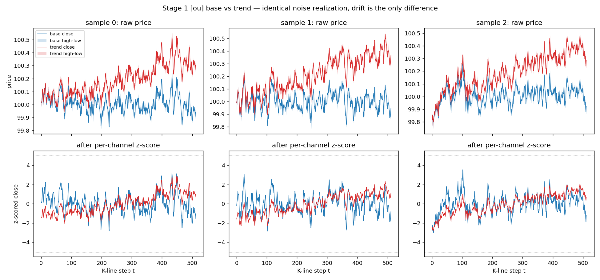
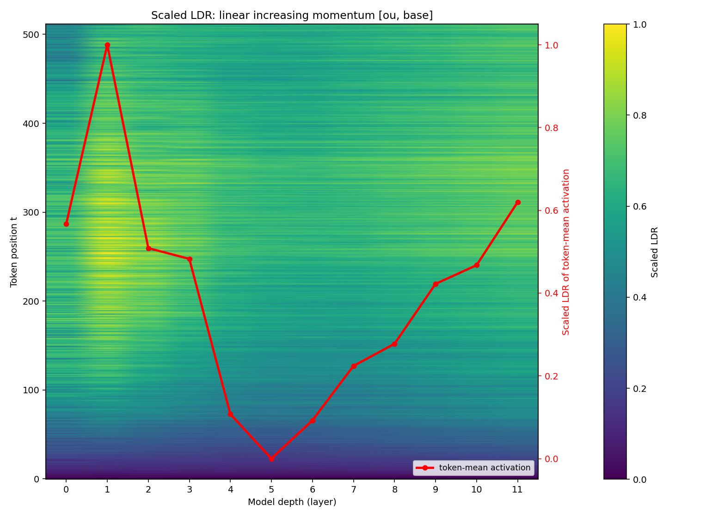
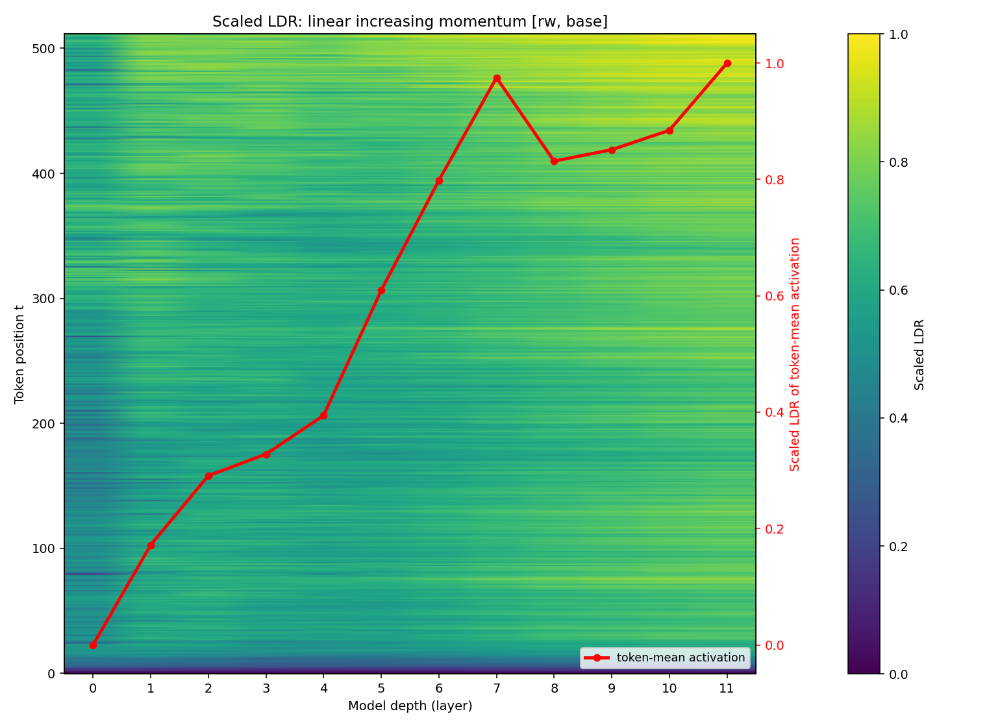
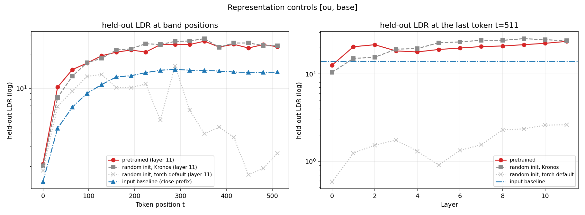
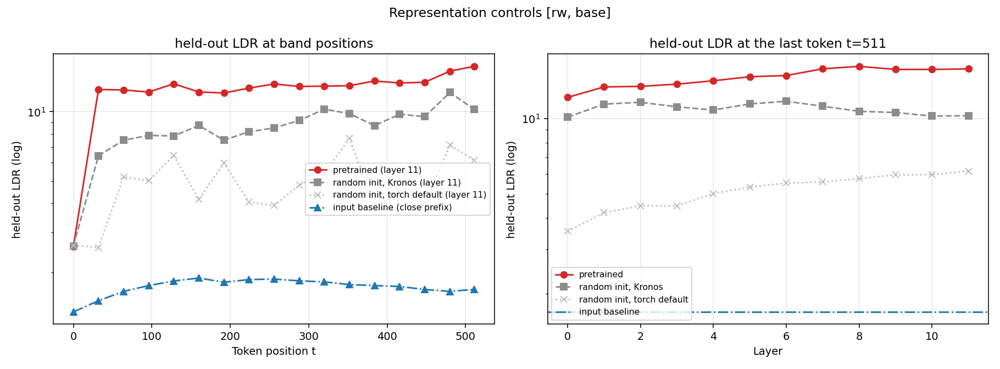
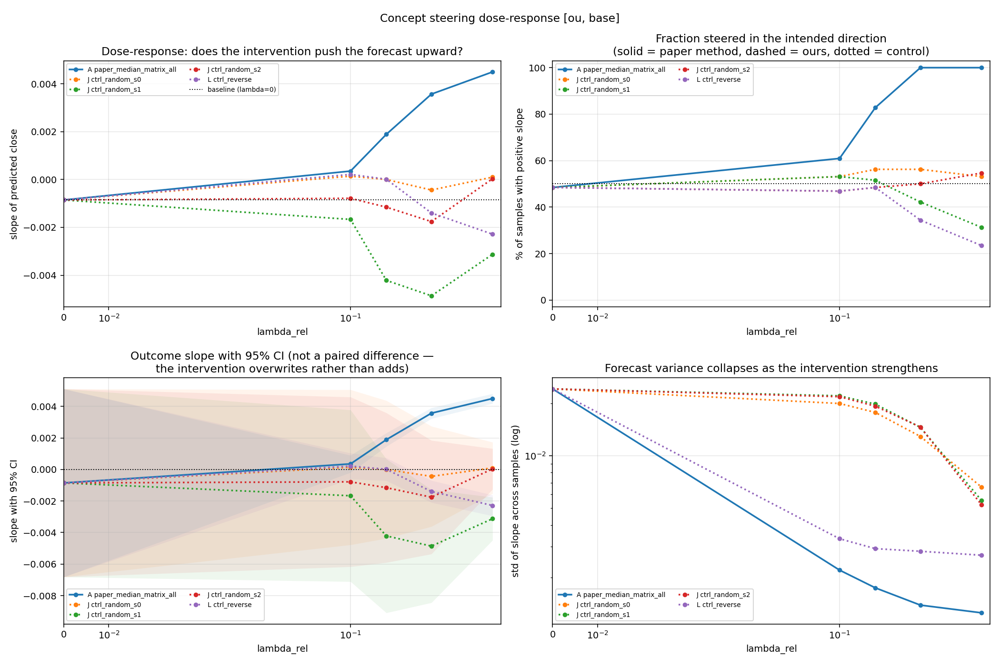
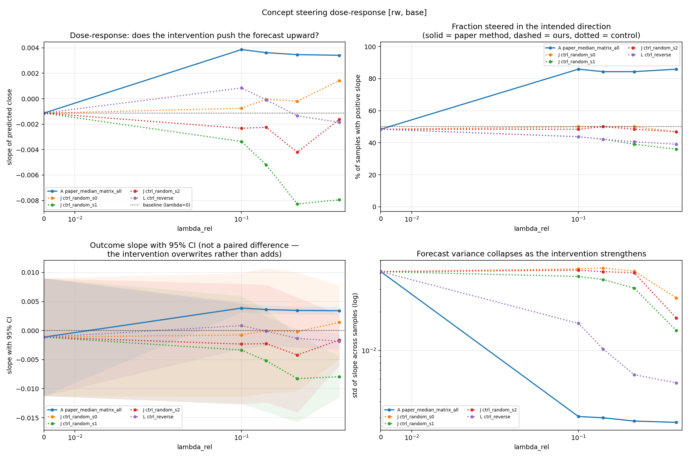
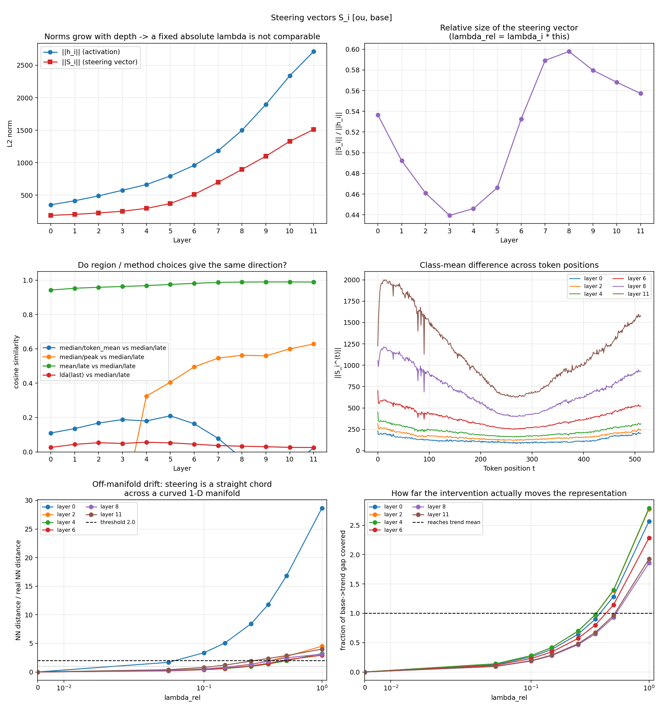
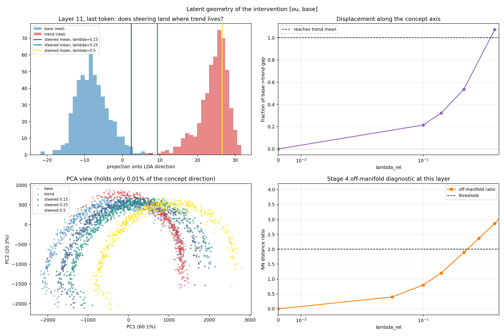

# 읽히는 방향과 움직이는 방향은 다르다

### Kronos-base의 "추세" 표현에 대한 선형 probing과 steering 검증

*Wiliński et al. (ICML 2025)의 표현·개입 방법론을 금융 TSFM에 옮기고, 대조 실험으로 해석의 범위를 정한다*

| | |
|---|---|
| 기준 실행 | `experiment/runs/v2_fast` · RunPod RTX 4090 · 2026-10-05 · code commit `83ebf62` |
| 비교 기준 | 1차 실험(0812, Colab) — 수치 출처 `experiment/0812_*.md` |
| 설계와 판정 규칙 | `docs/outline.md`, `docs/spec.md` |
| 방법론 원전 | Wiliński et al., *Exploring Representations and Interventions in Time Series Foundation Models*, ICML 2025 (arXiv:2409.12915v5) |
| 작성일 | 2026-10-05 |

---

## 이 보고서를 읽는 법

1절은 무엇을 묻는지, 2절은 왜 묻게 되었는지, 3절은 어떻게 실험했는지를 다룬다. 4절은 실행 전에 정해 둔 기준으로 나온 결과를 해석 없이 보이고, 5절은 그 결과가 왜 그렇게 나왔는지를 실제로 분석한 순서대로 따라간다. 6절에 한계와 후속 과제를, 부록에 재현 방법과 계산 정의를 두었다. 시간이 없다면 0절 요약과 5.11절 종합만 읽어도 결론은 전달된다.

이 연구는 "판정에 쓴 수치"와 "결과를 본 뒤 설명하려고 더 계산한 수치"를 엄격히 나눈다. 그래서 결과를 다루는 부분에는 근거의 종류를 꼬리표로 붙였다.

| 꼬리표 | 뜻 |
|---|---|
| **[사전]** | 실행 전에 고정한 지표와 규칙으로 나온 값. 실행 산출물(`fast_summary.md`, `stage*_summary.json`, 실행 로그)에 그대로 있다. |
| **[사후]** | 결과를 본 뒤 저장된 산출물만으로 더 계산한 기술 통계. 판정에는 쓰지 않았다. 다중 비교 보정이 없는 탐색적 분석이며, 계산 정의는 부록 C에 있다. |
| **[가설]** | 수치로 확인하지 않은 해석. 가능성으로만 읽어야 한다. |

그림 경로는 저장소 루트 기준(`experiment/runs/v2_fast/figs/v2/`)이다.

---

## 0. 요약

**질문.** 금융 K-line 데이터로 사전학습된 시계열 파운데이션 모델(TSFM) Kronos-base는 내부에서 "추세 없는 가격"과 "선형으로 오르는 가격"을 직선 하나로 가를 수 있게 표현하는가. 그렇다면 두 경우의 내부 표현 차이(steering vector)를 모델 안에 더해 예측을 상승 쪽으로 바꿀 수 있는가. 그리고 그 결과로 "모델이 추세라는 개념을 예측에 인과적으로 쓴다"고 말할 수 있는가.

**방법.** Wiliński et al. (ICML 2025)이 MOMENT, Chronos 등에 쓴 선형 프로브, LDR(분리도 지표), steering 방법을 Kronos-base에 그대로 옮겼다. 여기에 논문에 없는 대조군 다섯 가지(라벨 셔플 null, 입력 기준선, 무작위 초기화 모델, 랜덤 방향 개입, 역방향 개입)와 목표 분포(REF: 실제 추세 입력에 대한 모델의 무개입 예측)를 더했다. 어떤 수치가 나오면 어떤 결론을 쓸지는 실행 전에 고정했다. 데이터는 합성 OHLCV이며, 평균회귀 노이즈(OU)를 주 데이터로, 랜덤워크 노이즈(RW)를 강건성 확인용으로 썼다.

**결과 한눈에 보기** [사전]

| | OU (주 데이터) | RW (강건성) |
|---|---|---|
| held-out LDR (layer 11, t=511) | 23.53 | 15.74 |
| 라벨 셔플 null 대비 | 988배 | 631배 |
| 사전학습 ÷ 무작위 초기화(Kronos 방식) | 0.98 | 1.54 |
| 사전학습 ÷ 입력 기준선 | 1.69 | 9.31 |
| A 팔 양의 기울기 비율 (λ_rel 0.1 / 0.15 / 0.25 / 0.5) | 60.9 / 82.8 / 100 / 100% | 85.9 / 84.4 / 84.4 / 85.9% |
| 랜덤 방향 J 평균 (λ_rel 0.25) | 49.5% | 45.8% |
| 역방향 L 음의 기울기 비율 최대 | 76.6% | 60.9% |
| REF 양의 기울기 비율 | 0/64 | 32/64 |
| 표현 판정 문장 | 분리는 입력·구조에서 오며, 학습된 표현이라는 근거 없음 | 같음 |
| 개입 판정 | `direction_specific` · `reversible` 아님 · `ref_match` 아님 | `no_effect` · `reversible` 아님 |

> A는 논문 방법의 개입(+λS), J는 같은 크기의 랜덤 방향 개입, L은 부호를 뒤집은 개입(−λS), REF는 실제 추세 입력에 대한 무개입 예측이다. λ_rel은 더하는 벡터의 크기를 원래 활성화 크기에 대한 비율로 나타낸 개입 강도이고, "양의 기울기 비율"은 64개 입력 중 예측이 상승(기울기 > 0)으로 나온 비율이다.

**결론.** 실행 전에 허용해 둔 세 종류의 문장으로 쓰면 다음과 같다.

*(a) 선형 표현의 존재.* 두 클래스를 가르는 선형 방향은 두 데이터 모두에 있다. 그러나 같은 구조의 무작위 가중치 모델도 비슷한 분리도를 보여, 이 분리가 사전학습의 산물이라는 근거는 얻지 못했다.

*(b) 개입의 출력 효과.* 클래스 차이 방향(S)으로 개입하면 OU에서는 예측 기울기의 부호가 방향 특이적으로 양(+)에 모인다(64/64, 같은 크기의 랜덤 방향은 49.5%). RW에서는 84~86%로 사전 기준 90%에 못 미친다. 부호를 뒤집은 개입은 두 데이터 모두 기준에 못 미친다.

*(c) 자연 행동과의 일치.* 조정된 출력은 실제 추세 입력에 대한 모델의 예측과 다르다. OU에서는 두 분포가 완전히 갈리고 부호도 반대다.

따라서 1차 실험이 세운 가설, 곧 "steering이 작동하면 모델이 그 개념을 기저 기작으로 쓴다"를 지지하는 증거는 얻지 못했다.

**왜 그런 결과가 나왔나** [사후]. 결과를 뜯어보면 세 가지가 드러난다. 첫째, 개입의 주된 효과는 예측을 위로 옮기는 것이 아니라 입력에 대한 예측의 반응을 누르는 것이다. λ_rel 0.25~0.5에서 예측 기울기의 표준편차가 1/14~1/19로 줄고, 그 위에 작은 양의 값이 얹힌다. 둘째, steering vector S는 "추세"가 아니라 표현에서 분산이 가장 큰 방향, 곧 입력의 마지막 가격 수준을 따라가는 방향에 놓여 있다(layer 11에서 분산의 39~56%). 프로브가 찾은 판별 축과는 거의 직교한다(cos 0.02~0.04). 셋째, RW에서 끝까지 음수로 남는 9~10개 입력은 마지막 가격 수준이 가장 높은 입력이다.

한 문장으로 줄이면 이렇다. **두 클래스가 선형으로 "읽히는" 방향과 출력을 "움직이는" 방향은 서로 달랐고, 어느 쪽도 모델이 추세 개념을 예측에 쓴다는 증거가 되지 못했다.**

---

## 1. 연구 주제

### 1.1 연구 질문

이 연구는 1차 실험 설계(`0812 _1차실험_전체설계.md`)의 두 질문에서 출발했다. 첫째는 **존재**의 질문이다. "선형 증가 추세(모멘텀)"라는 개념이 Kronos의 표현 공간에 선형 표현(linear representation)으로 구분되어 있는가. 둘째는 **인과**의 질문이다. 그런 표현이 있다면, 각 층의 hidden representation에 steering vector S_i를 더하는 개입만으로, 추가 학습 없이 예측을 추세 방향으로 바꿀 수 있는가.

재실험(v2 fast track)에서는 이 두 질문을 실행 결과로 판정할 수 있는 다섯 질문으로 나눴다(`docs/spec.md` §0).

| ID | 질문 | 판정 재료 |
|---|---|---|
| Q0 | 1차(Colab) OU 결과가 재현되는가 | 1차 기준값 대 v2 실측 |
| Q1 | 선형 분리가 사전학습으로 생긴 것인가 | 입력 기준선 / 무작위 초기화 / 사전학습의 LDR |
| Q2 | steering 효과가 S 방향에 특이적인가 | A 대 J(랜덤 방향, seed 3개) |
| Q3 | 역방향(−λS)도 작동하는가 | L |
| Q4 | RW에서도 1차 OU의 결론이 유지되는가 | RW의 A, J, L, REF |

### 1.2 대상 모델: Kronos-base

Kronos-base는 K-line, 곧 봉 단위 OHLCVA(시가·고가·저가·종가·거래량·거래대금) 데이터 전용으로 사전학습된 decoder-only TSFM이다. Stage 0에서 실측한 구조는 다음과 같다(`logs/00_stage0.log`).

| 항목 | 값 |
|---|---|
| Transformer | 12층, d_model 832, d_ff 2048, 16 heads, 102.3M 파라미터 |
| 최대 컨텍스트 | 512봉 |
| 토크나이저 | Transformer 오토인코더 + BSQ, 3.96M 파라미터. 봉 하나를 coarse/fine 두 서브토큰(각 10비트)으로 양자화한 뒤 한 시퀀스 위치로 합친다 |
| 전처리 | 채널별 z-score 후 [−5, 5]로 clip |
| 위치 정보 | RoPE만 사용 |
| 고정 revision | 모델 `2b554741…`, 토크나이저 `0e011738…` |

방법론 논문이 다룬 MOMENT(encoder-only, patch 입력), Chronos(encoder-decoder, 이산 토큰), Moirai와 비교하면 Kronos는 세 가지가 다르다. 금융 데이터 전용이고, 입력을 이산 토큰으로 바꾸며, decoder-only 자기회귀 모델이다. decoder-only라는 것은 마지막 토큰의 표현이 곧 다음 봉을 예측하는 출력 경로라는 뜻이다. 그래서 논문에서 관찰된 현상(예: 토큰 하나에만 개입하면 실패한다)이 그대로 옮겨질지부터가 열린 질문이 된다.

전처리도 기억해 둘 필요가 있다. Kronos는 입력 창마다 채널별로 평균을 빼고 표준편차로 나눈다. 이 z-score가 "추세"를 모델 입장에서 어떤 모양으로 바꾸는지가 5절 분석의 열쇠가 된다.

### 1.3 방법론 원전과 이 연구가 더한 것

방법론은 Wiliński et al., *Exploring Representations and Interventions in Time Series Foundation Models*(ICML 2025, arXiv:2409.12915v5)에서 가져왔다. 저장소의 `representations-in-tsfms/`에 논문 PDF와 공식 구현(steertool)이 있다. 논문 3.2~3.3절과 부록 A·D의 방법은 세 단계로 요약된다.

**① 개념 하나만 다른 두 클래스를 만든다.** 합성 데이터로 두 묶음을 만든다. 논문의 "constant case"(기울기 m=0)와 "increasing slope case"(m>0)가 이 연구의 base와 trend에 대응한다.

**② 내부 어디서 두 클래스가 갈리는지 잰다.** 각 층·토큰의 residual stream(FFN 뒤)에서 Fisher criterion으로 선형 프로브를 학습하고 LDR로 분리도를 잰다. min-max로 스케일한 LDR 히트맵(논문 Fig. 7, 14)으로 분리가 강한 위치를 찾는다.

**③ 두 클래스의 차이만큼 밀어 본다.** steering 행렬 S_i = median(목표 클래스 활성화) − median(기준 클래스 활성화)를 층마다 토큰×차원 행렬로 만들고, 추론할 때 h_i ← h_i + λS_i로 더한다.

논문은 이 방법에 대해 다음을 보고한다. median과 mean은 차이가 없다. 토큰 하나에만 개입하면 실패하고 전 토큰에 개입해야 한다. 강도는 Chronos에서 λ≈0.1, MOMENT에서 λ=1이 적당하다. −λS를 더하면 방향이 뒤집힌다(부록 D). PCA 평면에서 조정된 표본이 목표 클래스 근처로 이동한다(Fig. 11).

그런데 논문의 steering 평가는 예시 그림과 PCA 이동이 중심이고, 해석에 꼭 필요한 비교 몇 가지는 본문과 부록 어디에도 없다. 이 연구는 그 비교들을 더했다. 각 비교가 없으면 무엇을 말할 수 없는지를 함께 적는다.

| 이 연구가 더한 비교 | 이것이 없으면 말할 수 없는 것 |
|---|---|
| 라벨을 섞은 null, held-out 분리 | 832차원에서는 아무 라벨로도 어느 정도 갈린다. 이 우연 수준보다 커야 "분리된다"고 말할 수 있다 |
| 입력 자체의 분리도 | 입력에서 이미 갈린다면 모델이 그 구분을 "만들었다"고 말할 수 없다 |
| 학습되지 않은 모델의 분리도 | 같은 구조의 무작위 가중치 모델도 갈린다면 사전학습의 산물이라고 말할 수 없다 |
| 같은 크기의 임의 방향 개입 | 아무 방향으로 같은 만큼 밀어도 같은 일이 생긴다면 그 효과를 S 방향의 것이라고 말할 수 없다 |
| 역방향 개입 | 반대로 밀었을 때 반대가 되지 않는다면 S를 "개념의 축"으로 보기 어렵다 |
| 목표 분포(실제로 그 개념을 가진 입력에 대한 무개입 출력) | 조정된 출력이 모델의 자연스러운 추세 반응과 닮지 않았다면 "모델이 그 개념을 써서 예측한다"고 말할 수 없다 |

논문의 표현 유사도(CKA)와 pruning 부분은 이 연구의 범위 밖이다.

### 1.4 핵심 용어

| 용어 | 뜻 |
|---|---|
| h_i^(t) | i번째 Transformer block의 출력, 곧 FFN 뒤 residual stream. 층 i, 토큰 위치 t에서의 832차원 벡터다. `model.transformer[i]`의 forward hook으로 꺼낸다 |
| base / trend | 추세가 없는 가격 / 선형으로 오르는 가격. 같은 표본 번호는 같은 노이즈를 공유하고 drift 항만 다르다 |
| OU / RW | 노이즈 과정의 종류. OU(평균회귀, θ=0.01)가 주 데이터이고 RW(랜덤워크)는 강건성 확인용이다 |
| LDR | Fisher 판별비. 두 클래스를 가장 잘 가르는 방향(LDA 방향)에 투영한 값의 (클래스 평균 차)² ÷ (클래스내 분산의 합). 클수록 잘 갈린다. 이 보고서는 학습에 쓰지 않은 held-out 표본의 값만 보고한다 |
| null | 라벨을 무작위로 섞은 뒤 같은 절차로 잰 LDR. "우연히 나오는 분리도"의 기준이다 |
| 프로브 축 (LDA 방향) | 프로브가 찾은, 두 클래스를 가장 잘 가르는 방향 |
| S | steering 행렬. 층 i, 위치 t마다 trend 중앙값 − base 중앙값. 대표 벡터가 필요할 때는 late 구간(마지막 1/16) 평균을 쓴다 |
| λ_rel | 상대 개입 강도 λ_i‖S_i‖/‖h_i‖. 더하는 벡터가 원래 활성화 크기의 몇 배인지를 뜻한다. 층별 절대 λ_i는 여기서 역산한다 |
| 팔(arm) | 개입 조건. A = 논문 방법(median × 행렬 × 전 토큰 × 12층), J = 같은 노름의 랜덤 방향(seed 0~2), L = −λS, REF = trend 입력의 무개입 예측 |
| 기준선 | base 입력에 아무 개입도 하지 않은 예측 |
| 양의 기울기 비율 | 64스텝 예측의 정규화 close에 OLS 직선을 맞췄을 때 기울기가 양수인 입력의 비율. 0.5에 대한 양측 이항검정으로 유의성을 본다 |
| 분산비 | 코드와 요약표에 쓰인 이름. 실제로는 기울기 표준편차의 비(개입 후 ÷ 기준선)다 |
| λ* | A 팔이 양의 기울기 비율 ≥ 0.9, p < 0.01을 만족하는 최소 λ_rel |
| subset32 | 평가 입력 64개 중 앞 32개. 1차 실험과 입력·배치·seed가 같다 |
| z_T | 입력 창의 마지막 정규화 종가. 창 평균보다 높게 끝나면 양수다 (5절 분석에서 사용) |
| 거칠기 | 정규화 close의 봉간 변화 크기, log 평균 \|Δz\| (5절 분석에서 사용) |

### 1.5 결론을 쓰는 규칙

결과를 본 뒤 해석이 원하는 쪽으로 흘러가는 것을 막기 위해, 실행 전에 결론을 쓰는 규칙을 정해 두었다(`docs/outline.md` §8). 말할 수 있는 것은 세 가지뿐이다. (a) 선형 표현이 존재하는가, (b) 그 방향으로 개입했을 때 출력이 어떻게 바뀌는가, (c) 그 변화가 모델의 자연스러운 행동과 일치하는가. "모델이 개념을 이해한다/이해하지 못한다"는 표현은 쓰지 않는다. 결론 문장은 실행 전에 만들어 둔 표에서 고르고, 판정 규칙은 결과를 본 뒤 바꾸지 않는다.

---

## 2. 연구 계기

### 2.1 논문이 열어 둔 질문

Wiliński et al.은 MOMENT, Chronos, Moirai에서 "개념이 선형으로 분리되고, 두 클래스의 차이를 더하면 출력이 그 개념 쪽으로 바뀐다"고 보고했다. 금융 K-line 전용 모델에서는 이것이 확인된 적이 없다.

가격 예측에서 추세(모멘텀)는 가장 기본적인 사전 개념이다. 게다가 논문의 "constant → increasing trend" 실험(Fig. 8 (iii), Fig. 11 (ii), Fig. 14 (ii))과 일대일로 대응하므로 논문과 같은 조건에서 비교할 수 있다. 앞서 말했듯 Kronos는 decoder-only이고 자기회귀로 생성하며 이산 토큰을 쓴다. 논문의 관찰이 이런 모델에도 그대로 옮겨지는지는 그 자체로 확인할 가치가 있는 질문이었다.

### 2.2 1차 실험이 얻은 것과 남긴 것

1차 실험(0812, Colab)의 목표 문장은 "steering이 작동함을 보여, Kronos가 가격 예측 시 해당 개념을 기저 기작으로 활용하고 있음을 증명한다"였다. 결과는 절반만 목표에 닿았다.

얻은 것은 분명했다. 선형 방향은 존재했다(held-out LDR 23.76, null 대비 987배). 논문 방법으로 예측 기울기를 양수로 모을 수도 있었다(λ_rel 0.25에서 32/32). 그러나 실제 추세 입력을 넣었을 때 모델은 추세를 외삽하지 않았고(OU 0/32, RW 53.1%), 조정된 출력은 이 분포와 닮지 않았다. 그래서 1차의 잠정 결론은 "steering이 작동한다 ⇒ 모델이 그 개념을 기저 기작으로 쓴다"는 추론이 성립하지 않는다는 것이었다.

1차는 논문과 어긋나는 관찰도 남겼다. 토큰 하나에만 개입해도 전 토큰 개입과 결과가 같았다(논문의 인코더 모델과 반대). 개념이 가장 잘 읽히는 얕은 층({1, 2})에만 개입하면 오히려 반대 방향으로 조정되었다. 프로브가 찾은 방향(LDA)으로 밀면 출력이 거의 바뀌지 않았다. 1차의 팔별 상세 결과는 부록 E에 있다.

그런데도 1차의 결론을 확정하지 못한 이유가 네 가지 있었고, 이것이 재실험의 직접 계기다.

**첫째, 완결되지 않았다.** RW 데이터의 개입 팔을 실행하지 못했다. 1차 문서 스스로 "RW 개입 팔이 확정의 관건"이라고 적었다.

**둘째, 방향 특이성을 확인하지 않았다.** 개입은 기울기 분포를 붕괴시켜(표준편차 0.023 → 0.001) 예측을 "전부 작은 양수"로 만들었다. 같은 크기의 임의 섭동도 그런 일을 할 수 있는데, 이를 가를 대조군이 없었다.

**셋째, 표현이 학습된 것인지 확인하지 않았다.** OU에서는 입력단 LDR(19.57)과 층 LDR(약 23.5)이 비슷했다. RW에서는 2.22에서 약 15로 커졌지만, 입력단은 1차원 통계이고 층은 832차원 LDA라 직접 비교할 수 없었다.

**넷째, 재현성이 약했다.** Colab 세션과 Drive에 의존해 로그와 중간 산출물을 다시 확인하기 어려웠다. 실행 도중 GPU를 T4에서 L4로 바꿨는데, 기준선의 양의 기울기 비율이 59.4%와 46.9%로 갈렸다.

### 2.3 재실험의 목적

재실험(v2)의 목적은 세 가지다. 같은 코드와 같은 시드로 1차의 핵심 수치를 다시 내는 **재현**, RW의 개입 팔까지 실행하는 **완결**, 랜덤 방향·역방향·무작위 초기화·입력 기준선 대조군을 더해 인과 해석의 범위를 정하는 **보강**이다. 이 가운데 가장 빨리 결론을 낼 수 있는 부분만 골라 pod 1대, 실행 1회로 묶었고(fast track), 나머지는 Tier 2 과제로 미뤘다(6.2절).

### 2.4 개인적 계기

*(작성자 보완 — 아래는 초안이다. 실제 계기에 맞게 고쳐 쓴다.)*

이 연구는 Kronos-base를 실제 투자에 적용해 성과를 확인하는 프로젝트(`Kronos-investing`)와 같은 흐름에서 나왔다. 금융 시계열은 신호 대 잡음비가 낮고 랜덤워크에 가까워서, 예측 성과만으로는 모델이 의미 있는 구조를 잡은 것인지 우연히 맞은 것인지 가리기 어렵다. 그래서 백테스트 성과를 재는 것과 별개로 모델 안을 직접 들여다보는 질문을 세웠다. 가장 기본적인 개념인 추세에서 시작해, 그 개념이 모델 내부에 있는지, 있다면 예측에 실제로 쓰이는지를 확인하는 것이다.

---

## 3. 실험 방법

### 3.1 전체 흐름

연구는 1차 실험의 설계와 실행, 재실험의 설계와 구현, 본 실행, 분석의 순서로 진행했다.

| 단계 | 내용 | 산출물 |
|---|---|---|
| 1차 설계 | 연구 주제, Step 1~5, 구현명세 7개 절 | `experiment/0812 _1차실험_전체설계.md`, `0812 _1차실험_구현명세.md` |
| 1차 실험 (Colab, T4 → L4) | OU: Stage 0~6 (9개 팔 × λ 8개 = 72조합 + REF). RW: Stage 1~4 + REF | `0812_1차실험_중간보고_stage0-4.md`, `0812_1차실험_구현단계.md` |
| 재실험 설계 | 전체 설계와 fast track 명세, 판정 규칙 사전 고정 | `docs/outline.md`, `docs/spec.md` |
| 코드 이식·확장 | 1차 코드를 옮기고 대조군, 러너, RunPod 스크립트 추가 | commit `08c3a2c` |
| 검증 | 단위 테스트 12개, 로컬 스모크(small, base), pod 스모크 | `experiment/code/tests/`, `RunPod/pod_smoke.sh` |
| 대조군 결정 | 무작위 초기화를 두 방식으로 돌리고 Kronos 자체 방식을 판정 기준으로 | commit `83ebf62` |
| 본 실행 | RTX 4090, OU → RW 순차, 23단계, 82.8분 | `experiment/runs/v2_fast/` |
| 회수·검증 | 로컬로 회수, checksum 대조(76개 파일). 요약은 결과 브랜치 `results/v2_fast` | `checksums.json`, `fast_summary.md` |
| 분석 | 사전 고정 판정 확인 뒤 사후 분석 | 이 보고서 5절 |

### 3.2 합성 데이터

**설계 아이디어.** 두 클래스는 "같은 노이즈에 drift가 있느냐 없느냐"만 다른 쌍둥이다. base는 `b + W(τ)`, trend는 `b + m·τ + W(τ)`이고, 같은 표본 번호는 같은 노이즈 경로 W를 공유한다. 이렇게 하면 두 클래스의 차이는 drift 항 하나로 통제된다.

**생성 방식.** 봉 하나를 15스텝으로 쪼갠 미세 격자(총 7680스텝) 위에서 경로를 만들고, 이를 봉 단위로 집계해 OHLC를 얻는다. 시가·고가·저가·종가가 실제 경로에서 나오므로 OHLC 순서 제약(coherence)은 정의상 지켜진다. 주요 설정은 길이 T 512, sigma 0.01, OU θ 0.01, 클래스당 2048표본, seed 20250812다. 거래량과 거래대금(V/A)은 0으로 두었고, 두 클래스의 timestamp는 같다.

**drift 크기는 SNR로 정한다.** snr을 U(3, 6)에서 뽑고 총 drift = snr × 노이즈 크기로 둔다. z-score가 가격의 절대 스케일을 지우기 때문에 모델이 실제로 보는 것은 drift와 노이즈의 이 비율뿐이다.

**주요 결정과 근거.** 로그가격에 exp를 취하지 않았다. 선형 drift가 지수 추세로 바뀌는 것을 피하기 위해서다. OU를 주 데이터로 둔 것은, RW에서는 base 표본 상당수가 우연히 추세를 가져 라벨이 흐려지고 입력단 LDR이 snr을 아무리 키워도 약 1.9에서 포화했기 때문이다(1차 실측). V/A를 0으로 둔 것은 Kronos가 학습 때 5% 확률로 V/A를 0으로 가렸으므로 이런 입력에서도 표현이 무너지지 않기 때문이다. 1차에서는 OU를 0에서 시작해 모든 표본이 같은 점에서 출발하는 바람에 첫 토큰의 분리도가 가장 높게 나오는 결함이 있었고, burn-in을 넣어 고쳤다.

**검증.** 생성된 데이터는 다음 점검을 통과했다(`logs/<noise>_01_stage1.log`, `data/v2/<noise>/meta.json`). 두 데이터 모두 1차와 지문(fingerprint)이 일치하고, 노이즈 공유 오차는 10⁻⁴ 미만이며, OHLC 위반과 클리핑은 없다. 눈여겨볼 행은 입력단 LDR이다. OU는 입력의 기울기 하나만으로도 두 클래스가 크게 갈리고(19.569), RW는 잘 갈리지 않는다(2.220).

| 지표 | OU | RW |
|---|---|---|
| data_fingerprint (1차와 대조) | `d8e4765c83adf538` 일치 | `6bdc0a9a4f572cd5` 일치 |
| 입력단 LDR (close 기울기 1차원) | 19.569 | 2.220 |
| base 95퍼센타일을 넘는 trend 비율 | 100.0% | 95.0% |
| 노이즈 공유 오차 (close 차이의 상대오차) | 1.79e-05 | 1.45e-06 |
| coherence 위반 / 클리핑률 | 0건 / 0% | 0건 / 0% |
| 정규화 close 기울기 (base 평균±std → trend 평균±std) | 0.00002±0.00109 → 0.00533±0.00051 | −0.00004±0.00441 → 0.00656±0.00039 |



*그림 1. OU 표본 3개의 원시 가격과 z-score 후 close (base / trend). 논문 Fig. 3, 9에 대응한다. 입력 진단(위치별 평균 수준, 기울기 분포, 클리핑, snr 대 기울기)은 `stage1_<noise>_diagnostics.png`에 있다.*

### 3.3 내부 표현을 재는 법: probing

**어디를 보나.** `model.transformer[i]`의 forward hook 출력, 곧 논문과 같은 FFN 뒤 residual stream을 본다. 모델을 고칠 필요가 없다. 꺼낸 활성화의 형태는 [층 12, 표본 N, 위치 512, 차원 832]이다. probing에는 자기회귀 생성이 아니라 컨텍스트를 한 번 통과시킨 forward(`decode_s1`)의 활성화를 쓴다.

**어떻게 재나.** Fisher criterion을 LDA 닫힌 해로 푼다. 프로브 방향은 `w = (Σ_w + εI)^-1 (μ_s − μ_c)`이고, LDR은 활성화를 w에 투영한 값으로 계산한다. 직관적으로 LDR은 "두 클래스를 가장 잘 가르는 직선 위에서, 두 무리의 중심이 각자의 퍼짐에 비해 얼마나 멀리 떨어져 있는가"를 잰다. 예를 들어 두 클래스의 분산이 같다면 LDR 23.5는 중심 간 거리가 표준편차의 약 7배라는 뜻이다. 공식 구현과 수치를 대조했고, 차이는 분산 분모의 관례(ddof) 하나뿐이어서 ddof=0으로 맞췄다. 층 × 위치 6144개 프로브는 GPU 배치 연산으로 한꺼번에 처리한다.

**과적합을 막는 장치.** 논문에 없는 통제를 처음부터 넣었다. 표본을 train 1434 / held-out 614로 나눠 held-out 값만 보고하고, 라벨을 섞은 null을 같은 절차로 잰다. train 표본 수가 차원 수의 1.72배밖에 안 되므로 공분산에 trace 기준 상대 shrinkage 1e-3을 준다.

### 3.4 개입하는 법: steering

개입 실험의 흐름은 단순하다. base 입력을 넣고, 모델이 예측을 생성하는 동안 매 층·매 위치의 표현에 λ_i·S를 더한 뒤, 나온 64스텝 예측이 오르는지 내리는지를 본다.

```
base 입력 (512봉) ──► Kronos-base 12층 ──► 64스텝 예측 ──► 정규화 close의 OLS 기울기 ──► 부호 집계
                         ▲
                         └── 각 층 i, 각 위치 t의 residual stream에 + λ_i · S_i^(t)
```

**S를 만든다.** 논문대로 위치별 행렬을 median으로 만든다. 대표 벡터가 필요할 때는 late 구간(마지막 1/16)을 평균한다. 전 토큰을 평균하면 초반 위치의 가격 수준 오프셋에 오염되기 때문이다(late 집계와의 코사인 0.12).

**어디에 더하나.** 12개 층 전부, 모든 위치에 더한다. 생성 중에는 디코딩 스텝마다 hook이 발화한다. 컨텍스트 길이가 max_context(512)와 같아 첫 스텝부터 창이 한 칸씩 밀리므로, 창의 각 위치를 원래 인덱스에 맞춰 S의 해당 행을 더하고, 새로 생성된 토큰에는 S의 마지막 행을 쓴다.

**얼마나 세게.** 활성화 노름이 층에 따라 7.7배까지 달라서, 같은 절대 λ를 전 층에 쓰면 층마다 의미가 다르다. 그래서 강도를 상대값 λ_rel로 정하고 층별 λ_i를 역산한다. 시험한 값은 λ_rel ∈ {0, 0.1, 0.15, 0.25, 0.5}다.

**어떻게 평가하나.** 정규화 공간에서 예측 close의 64스텝 OLS 기울기를 본다. Kronos는 sample_count 5개 샘플 경로를 평균해 돌려주며, 샘플링은 temperature 1.0, top_p 0.9다. OHLC coherence는 역정규화한 뒤에 확인한다. 채널마다 따로 정규화하므로 정규화 공간에서는 L ≤ O, C ≤ H 같은 순서가 보존되지 않기 때문이다. 판정 통계는 기울기 부호의 이항검정이다. 기준선과 같은 입력끼리 비교하는 대응표본 검정을 쓰지 않은 이유는 5.5절에서 수치로 보인다.

### 3.5 대조군과 개입 팔

1차와 비교할 수 있도록 데이터 생성, S 산출, 평가 절차, 샘플링 설정은 1차와 똑같이 두었다. 바꾼 것은 평가 입력 수 하나다. 32개에서 64개로 늘렸고, 32개씩 두 번 생성하며 k번째 묶음의 seed는 seed + k다. 그래서 앞 32개(subset32)는 1차와 입력·배치·seed가 같다. 재현성을 위해 모델·토크나이저 revision을 고정하고, float32로 추론하며 TF32를 끄고, GPU는 RTX 4090 한 종류만 썼다.

**표현 대조군.** 17개 위치(0, 32, …, 480, 511)에서 같은 LDA·held-out·null 절차로 세 가지를 비교한다.

| 대조군 | 무엇인가 | 답하는 질문 |
|---|---|---|
| 입력 기준선 | 위치 t까지의 정규화 close 경로(차원 t+1)에 대한 LDA | 모델 없이 입력만으로 얼마나 갈리나 |
| 무작위 초기화 Kronos-base | 구조와 사전학습 토크나이저는 그대로 두고 Transformer 가중치만 초기화 | 학습하지 않은 같은 구조로도 갈리나 |
| 사전학습 모델 | 실제 Kronos-base | (비교 대상) |

**개입 팔.**

| 팔 | 입력 | 더하는 것 | 답하는 질문 |
|---|---|---|---|
| `A_paper_median_matrix_all` | base held-out 64개 | λ_i · S (median, 위치별 행렬), 전 토큰, 12층 | 논문 방법으로 예측이 오르나 |
| `J_ctrl_random_s0`, `_s1`, `_s2` | 같음 | 층·위치마다 S와 같은 L2 노름의 가우시안 방향. 층, 범위, λ_i는 A와 같다 | 아무 방향으로 같은 만큼 밀어도 그런가 |
| `L_ctrl_reverse` | 같음 | −λ_i · S | 반대로 밀면 내려가나 |
| `REF_trend_unsteered` | trend held-out 64개 | 없음 | 모델은 진짜 추세 입력에 어떻게 반응하나 |

### 3.6 대조군 설계의 결정: 무작위 초기화를 어떻게 할 것인가

"학습하지 않은 모델"을 만드는 방법은 하나가 아니다. PyTorch 기본 초기화(`reset_parameters()`)는 임베딩을 N(0, 1)로 초기화해 Kronos 자체 초기화보다 약 29배 크다. 그러면 각 블록의 출력이 residual에 거의 더해지지 않아, 사실상 "층을 지나도 아무 일도 일어나지 않는 모델"이 된다.

실측이 이를 확인했다. 로컬(base 구조)에서 층당 블록 기여는 사전학습 모델이 0.21~0.39, Kronos 초기화가 0.32~0.49였지만 torch 기본 초기화는 0.009~0.010이었다. torch 기본에서는 마지막 층 출력과 입력 임베딩의 코사인이 0.999였다. 본 실행 로그의 활성화 평균 절댓값도 같은 그림을 보여 준다.

| 활성화 평균 절댓값 | layer 0 | layer 6 | layer 11 |
|---|---|---|---|
| torch 기본 초기화 | 13.445 | 13.445 | 13.453 |
| Kronos 초기화 | 1.026 | 1.681 | 2.229 |
| 사전학습 | 6.637 | 22.141 | 46.969 |

그래서 본 실행 전(2026-10-05)에 두 방식을 모두 돌리되, 판정에는 Kronos 자체 초기화(`_init_weights`: Linear는 xavier normal, Embedding은 std = d_model^-0.5)만 쓰고 torch 기본은 참고 열로 두기로 정했다. torch 기본은 "학습되지 않은 트랜스포머"라기보다 "위치별 토큰 임베딩"에 가까운 대조군이기 때문이다. 이 결정은 결론을 좌우한다. 그 영향은 5.3절에서 그대로 보인다.

### 3.7 사전 고정 판정 규칙

개입 결과는 다음 규칙으로 판정한다(`docs/spec.md` §2.2). 모두 실행 전에 고정했다.

| 판정 | 조건 | 뜻 |
|---|---|---|
| `A_up` | A가 어떤 λ>0에서 양의 기울기 비율 ≥ 0.9 이고 p < 0.01. 그 최소 λ가 λ* | 논문 방법으로 예측이 오른다 |
| `direction_specific` | `A_up`이고, λ*에서 J 세 seed의 양의 비율 평균이 [0.3, 0.7] 안 | 그 효과는 S 방향의 것이다 |
| `generic_perturbation` | `A_up`이고, λ*에서 J 평균 ≥ 0.9 | 아무 방향이나 같은 효과를 낸다 |
| `no_effect` | `A_up` 아님 | 사전 기준을 넘는 상향 효과가 없다 |
| `collapse_generic` | λ*에서 J의 분산비 평균 ≤ 0.2 | 분포 붕괴는 방향과 무관하다 |
| `reversible` | L이 어떤 λ>0에서 음의 기울기 비율 ≥ 0.9 이고 p < 0.01 | 반대로 밀면 반대가 된다 |
| `ref_match` | λ*에서 A 기울기 분포 대 REF의 KS p ≥ 0.05 | 조정된 출력이 자연스러운 추세 반응과 닮았다 |

표현 쪽 판정 문장은 마지막 층·t=511에서의 LDR 비율(사전학습 ÷ 무작위 초기화, 사전학습 ÷ 입력 기준선)로 고른다. 비율이 [0.5, 2] 안이면 "비슷"으로 본다. 다만 임계 2는 근거가 있는 값이 아니라고 명세에 적어 두었으므로, 이 보고서는 판정 문장과 함께 비율 자체를 늘 보인다.

### 3.8 구현, 검증, 실행

**파이프라인.** 본 실행은 Stage 0~7로 이뤄지며 OU와 RW를 차례로 돌렸다.

| Stage | 하는 일 | 주요 산출물 | 소요 (OU / RW) |
|---|---|---|---|
| 0 | 환경, 모델 스펙 실측, hook 형태, 결정성, V/A=0 예측 | `stage0_report.json` | 31초 (공통) |
| 1 | 데이터 생성, 검증, 지문 대조 | `data/v2/<noise>/` | 19초 / 13초 |
| 2 | 활성화 추출. 사전학습 모델은 전 위치(39GB, scratch), 무작위 초기화 두 종은 17개 위치 | scratch | 107+72+57초 / 138+76+62초 |
| 3 | 층×위치 LDA·LDR(held-out, null), 대조군 비교 | `ldr.npz`, `stage3_summary.json`, `stage3_controls.json` | 129초 / 139초 |
| 4 | S 산출, λ 캘리브레이션, OOD 진단 | `steering.npz`, `stage4_summary.json`, `pca_subset.npz` | 42초 / 47초 |
| 5 | 개입 생성: A, J×3, L 각 λ 4개 + 기준선 + REF | `steer/results.json` (26조합) | 1811+130초 / 1817+138초 |
| 6 | 팔별 요약, 사전 고정 판정, REF 대비 KS | `stage6_summary.json`, `.csv` | 27초 / 26초 |
| 7 | Q0~Q4 요약, outline §8 문장 선택 | `fast_summary.md`, `.json` | 1초 |

**코드와 검증.** 1차 코드를 옮긴 뒤 명세에 적힌 변경만 얹었다(구조는 `docs/outline.md` §9, 변경 목록은 `docs/spec.md` §3). 단위 테스트 12개는 랜덤 payload의 노름·seed·코사인, 역방향 payload, 자기회귀 롤링 때의 위치 정합, 무작위 초기화 두 방식, checksum, 생성을 나눠 돌린 결과가 나누지 않은 결과와 같은지, 사전 고정 판정의 각 갈래를 확인한다. 로컬에서는 Kronos-small과 revision을 고정한 base로 전체 계획을 축소 실행했고, pod에서는 `pod_smoke.sh`로 GPU, 디스크, 토큰, 설치, 스모크 계획을 확인했다(첫 실행 약 23분, 재실행 약 6분).

**본 실행.** `RUN_ID=v2_fast bash RunPod/runpod.sh`로 2026-10-05 06:09~07:31 UTC에 돌렸다. 23단계, 82.8분, 종료 코드 0이다. 환경은 Python 3.12.3, torch 2.14.1+cu130, CUDA 13.0, RTX 4090(driver 580.178.04)이다.

**재현성 장치.** 코드 커밋과 config 해시, 모델 revision, GPU·드라이버·torch 버전을 `manifest.json`에 기록하고 단계별 로그 전문을 `logs/`에 남긴다. 커밋되지 않은 코드로는 실행이 시작되지 않게 했고, 회수한 뒤에는 checksum으로 대조한다.

### 3.9 과정에서 만난 문제와 조치

| 시점 | 문제 | 조치 |
|---|---|---|
| 1차 | RW의 입력단 분리도가 약 1.9에서 포화 | OU를 주 데이터로, RW는 강건성 확인용으로 |
| 1차 | OU를 0에서 시작해 첫 토큰 분리도가 부풀려짐 | burn-in 추가 |
| 1차 | 위치별 LDR의 raw 최댓값이 노이즈를 고름 | 25점 이동평균과 구간 평균으로 판정 |
| 1차 | 토큰 평균으로 집계한 S가 가격 수준 오프셋에 오염 | late 구간 사용 |
| 1차 | 절대 λ가 층마다 다른 세기를 뜻함 | 상대 강도 λ_rel |
| 1차 | 대응표본 검정이 효과를 잡지 못함 | 결과 부호의 이항검정 |
| 1차 | GPU 교체로 기준선 양의 비율이 59.4% / 46.9%로 갈림 | v2는 GPU 한 종류, TF32 off, 배치 고정 |
| v2 | torch 기본 초기화 대조군이 층을 지나도 변하지 않음 | 두 방식 실행, Kronos 방식을 판정 기준으로 |
| v2 | 스모크에서 Stage 6이 λ 격자 불일치로 중단 | 본 실행 전에 수정 |
| v2 | 평가 입력을 늘리면 1차와 직접 비교가 안 됨 | 앞 32개를 1차와 같은 호출로 두고 subset32로 따로 보고 |

---

## 4. 결과

이 절은 실행 전에 고정한 지표와 판정을 그대로 보인다. 해석은 5절로 미룬다. 이 절의 수치는 모두 **[사전]**이다.

### 4.0 실행 무결성

실행은 정상 종료했다(`cloud_run.json`: status ok, exit 0, 82.8분, `verify-run` 통과). 노이즈마다 세 번의 활성화 추출(사전학습, 무작위 초기화 두 종)이 모두 결정적이었고 NaN은 없었다. 무작위 초기화는 모델 해시만 바꾸고(`510ac23b…` → `7f93f9c6…` / `37e2af16…`) 토크나이저 해시는 그대로 두었다. 개입 결과는 노이즈당 26조합(5개 팔 × λ 5개 + REF)이 모두 나왔고, 회수 후 checksum 대조(76개 파일, 전체 280MB)도 통과했다.

### 4.1 Q0 — 1차 결과는 재현되는가: 재현된다

판정 대상 항목 가운데 불일치는 0건이다.

| 항목 | 1차 | v2 | 판정 | 기준 |
|---|---|---|---|---|
| data_fingerprint | d8e4765c83adf538 | 같음 | 일치 | 완전 일치 |
| 입력단 LDR | 19.57 | 19.569 | 일치 | 소수 둘째 자리 |
| held-out LDR layer 0 mid | 22.99 | 22.99 | 일치 | 상대오차 5% |
| held-out LDR layer 1 mid | 29.27 | 29.27 | 일치 | 〃 |
| held-out LDR layer 11 late | 23.76 | 23.76 | 일치 | 〃 |
| held-out LDR layer 11 last | 23.52 | 23.53 | 일치 | 〃 |
| null 대비 배율 | 987 | 988 | 일치 | 같은 자릿수 |
| 평활 LDR 정점 위치 (층 중앙값) | 259~350 | 350 | 일치 | 1차 범위 안 |
| cos(mean, median) | 0.978 | 0.9814 | 일치 | 차이 0.01 |
| cos(LDA, median) | 0.04 | 0.0438 | 일치 | 〃 |
| A 팔 λ=0.25 양의 기울기 (subset32) | 100% | 32/32 | 일치 | 분류·유의성 동일 |
| A 팔이 상향되는 최소 λ (subset32) | 0.25 | 0.25 | 일치 | 동일 |
| A 팔 최소 분산비 (subset32) | 0.046 | 0.0511 | 일치 | 같은 자릿수 |
| 기준선 양의 기울기 비율 (subset32) | 0.469 | 15/32 | 참고 | 1차도 GPU에 따라 0.594 / 0.469 |
| REF 양의 기울기 비율 (subset32) | 0.0 | 0/32 | 일치 | ±2/32 |

### 4.2 Q1 — 선형 분리는 사전학습으로 생긴 것인가: 근거 없음

| held-out LDR, layer 11 | 입력 기준선 | 무작위 (Kronos 초기화) | 무작위 (torch 기본, 참고) | 사전학습 | 사전학습 ÷ 무작위 | 사전학습 ÷ 무작위(torch) | 사전학습 ÷ 입력 |
|---|---|---|---|---|---|---|---|
| OU, t=511 | 13.95 | 23.97 | 2.62 | 23.53 | 0.98 | 8.98 | 1.69 |
| OU, 17개 위치 평균 | 11.76 | 20.91 | 7.12 | 20.40 | 0.98 | 2.87 | 1.74 |
| RW, t=511 | 1.69 | 10.24 | 6.16 | 15.74 | 1.54 | 2.56 | 9.31 |
| RW, 17개 위치 평균 | 1.74 | 8.52 | 4.91 | 12.52 | 1.47 | 2.55 | 7.21 |

두 데이터 모두 사전학습 ÷ 무작위 초기화(Kronos 방식) 비율이 임계 2보다 작아(OU 0.98, RW 1.54), 같은 문장이 선택되었다.

> **분리는 입력·구조에서 오며, 학습된 표현이라는 근거 없음**

분리 자체는 뚜렷하다. 라벨을 섞은 null의 최댓값은 두 데이터 모두 0.024에 불과하다. 분리가 가장 강한 지점은 두 데이터가 다르다. OU에서는 전역 최대가 layer 1, t=259(평활 LDR 29.34)이고 late 구간 최고는 layer 11(23.76)이어서, 정점이 창의 마지막 10% 안에 있지 않다. RW에서는 전역 최대가 layer 11, t=511(평활 15.62)로 마지막 토큰이 정점이다. 한편 활성화의 상위 2개 주성분(PC)이 분산의 79.7%(OU) / 63.8%(RW)를 담지만, 그 안에 든 LDA 방향의 비중은 0.01% / 0.02%뿐이다. 두 클래스를 가르는 방향은 표현에서 크게 흔들리는 방향과 거의 겹치지 않는다는 뜻이며, 이 점은 5절에서 중요해진다.



*그림 2. OU, 층 × 위치의 스케일된 held-out LDR 히트맵. 분리는 창의 중간에서 가장 강하다. 논문 Fig. 7, 14 (ii)에 대응한다.*



*그림 3. RW, 같은 히트맵. 분리는 마지막 토큰과 깊은 층으로 갈수록 강해진다.*



*그림 4. OU, 입력 기준선 / 무작위 초기화 두 종 / 사전학습 모델의 위치별·층별 held-out LDR.*



*그림 5. RW, 같은 비교.*

### 4.3 Q2·Q3 — 효과는 S 방향에 특이적인가, 반대로도 되는가 (n = 64)

**OU**

| λ_rel | A 양의 비율 (p) | A 분산비 | J seed별 양의 비율 | J 평균 | J 분산비 평균 | L 음의 비율 (p) | L 분산비 |
|---|---|---|---|---|---|---|---|
| 0.1 | 60.9% (1.0e-01) | 0.091 | 53 / 53 / 47% | 51.0% | 0.880 | 53.1% (7.1e-01) | 0.138 |
| 0.15 | 82.8% (1.0e-07) | 0.072 | 56 / 52 / 48% | 52.1% | 0.782 | 51.6% (9.0e-01) | 0.121 |
| 0.25 | 100.0% (1.1e-19) | 0.057 | 56 / 42 / 50% | 49.5% | 0.580 | 65.6% (1.7e-02) | 0.117 |
| 0.5 | 100.0% (1.1e-19) | 0.052 | 53 / 31 / 55% | 46.4% | 0.239 | 76.6% (2.4e-05) | 0.111 |

**RW**

| λ_rel | A 양의 비율 (p) | A 분산비 | J seed별 양의 비율 | J 평균 | J 분산비 평균 | L 음의 비율 (p) | L 분산비 |
|---|---|---|---|---|---|---|---|
| 0.1 | 85.9% (3.5e-09) | 0.075 | 50 / 44 / 48% | 47.4% | 0.997 | 56.2% (3.8e-01) | 0.396 |
| 0.15 | 84.4% (2.0e-08) | 0.073 | 50 / 42 / 50% | 47.4% | 0.978 | 57.8% (2.6e-01) | 0.250 |
| 0.25 | 84.4% (2.0e-08) | 0.069 | 50 / 39 / 48% | 45.8% | 0.911 | 59.4% (1.7e-01) | 0.158 |
| 0.5 | 85.9% (3.5e-09) | 0.067 | 47 / 36 / 47% | 43.2% | 0.469 | 60.9% (1.0e-01) | 0.136 |

개입하지 않은 기준선(base 입력)의 양의 기울기 비율은 두 데이터 모두 31/64(48.4%)다. 랜덤 방향 J와 S의 코사인 절댓값은 층 평균 0.0272~0.0279로, J는 S와 거의 직교한다. OHLC coherence 위반은 최대 OU 0.02%, RW 1.05%(J seed 2, λ_rel 0.5)였다.

표를 읽는 요령은 이렇다. OU에서 A는 λ_rel 0.25부터 64개 모두 상승으로 모이지만, 같은 크기의 랜덤 방향 J는 50% 안팎에 머문다. RW에서 A는 처음부터 85% 안팎에서 더 오르지 않는다. 역방향 L은 두 데이터 모두 음의 비율 90%에 한참 못 미친다.



*그림 6. OU, λ_rel에 따른 예측 기울기의 평균, 양의 비율, 95% 구간, 표준편차. 논문 Fig. 8, 10의 예시 그림을 집계 지표로 대신한다.*



*그림 7. RW, 같은 그림.*

### 4.4 Q4 — 조정된 출력은 목표 분포(REF)와 닮았는가: 닮지 않았다

| | 기준선 (base 입력, 무개입) | REF (trend 입력, 무개입) | A (λ_rel 0.25) | A 대 REF의 KS p |
|---|---|---|---|---|
| OU 기울기 평균 ± std | −0.00085 ± 0.02415 | −0.06431 ± 0.01571 | +0.00357 ± 0.00139 | 8.35e-38 |
| OU 양의 비율 | 31/64 | 0/64 | 64/64 | |
| RW 기울기 평균 ± std | −0.00113 ± 0.04103 | −0.00800 ± 0.02142 | +0.00346 ± 0.00282 | 1.73e-05 |
| RW 양의 비율 | 31/64 | 32/64 | 54/64 | |

가장 눈에 띄는 것은 REF다. OU에서 실제 추세 입력을 넣으면 모델은 64개 모두 **하락**을 예측한다. 추세를 이어 그리지 않는다.

### 4.5 판정 요약 (spec §2.2)

| | A_up | λ* | 판정 | λ*에서 J 평균 | collapse_generic | reversible | ref_match |
|---|---|---|---|---|---|---|---|
| OU | True | 0.25 | `direction_specific` | 49.5% | False | False | False |
| RW | False | 없음 | `no_effect` | 해당 없음 | 해당 없음 | False | 해당 없음 |

사전에 만들어 둔 문장표(outline §8.2)에서 선택된 문장은 다음과 같다.

> **OU** — 방향 특이적 조정은 가능하나, 모델이 실제 추세 입력에 하는 계산과 다른 출력을 주입 (1차 OU 잠정 결론과 같음)
>
> **RW** — 해당 설정에서 인과적 사용의 증거 없음

---

## 5. 결과 분석

### 5.1 분석의 원칙과 순서

판정은 실행 전에 고정한 규칙으로만 내린다. RW의 `no_effect`처럼 경계에 걸린 경우에도 규칙을 바꾸지 않는다. 이 절의 분석은 "왜 그런 판정이 나왔는가"를 설명하기 위한 것이며 판정을 바꾸지 않는다. 사후 분석에는 저장된 산출물만 썼다. 표본별 기울기 64개(`steer/results.json`), 대조군 격자(`stage3_controls.json`), `steering.npz`, `pca_subset.npz`, `data/v2/`가 그것이다.

분석은 다음 순서로 진행했다. 실행 중에는 단계별 로그와 OU 중간 요약으로 수치를 확인했다. 실행 직후에는 `fast_summary.md`의 사전 판정을 읽고 경계에 걸린 네 가지를 표시했다. RW의 사전학습 ÷ 무작위 비율 1.54가 임계 2에 가깝고 무작위 초기화 seed가 하나뿐이라는 점, RW의 A는 유의하지만 90%에 못 미친다는 점, 역방향이 비대칭이라는 점, 랜덤 방향도 λ_rel 0.5에서는 분산을 줄인다는 점이다. 보고서를 준비하면서 아래 분석 1~10을 차례로 했다. 5.2절이 분석 1·2이고, 5.3절부터 5.10절이 분석 3~10에 해당한다.

### 5.2 실행은 믿을 수 있고, 1차 결과는 우연이 아니었다 (분석 1·2)

**실행의 신뢰성.** `manifest.json`, `cloud_run.json`, 모든 단계 로그, checksum을 확인했다. 4.0절의 항목이 모두 성립하고 [사전], 실행된 코드는 commit `83ebf62`이며 pod는 origin의 커밋만 받는다. 무작위 초기화 대조군도 설계대로 동작했다. torch 기본 초기화에서는 활성화 크기와 클래스 간 차이가 층을 지나도 변하지 않는다(OU 클래스 간 차이 16.53 → 16.54 → 16.55). 그러니 이후의 수치는 실행 오류가 아니라 실험 결과로 다뤄도 된다.

**재현의 범위.** 판정 대상 14개 항목은 모두 일치했다 [사전]. 요약표 밖의 값까지 비교해 보면 [사후], OU Stage 3의 12개 층 × 4개 구간 48개 LDR 값이 1차 표와 최대 0.013 차이이고, 평활 정점 위치는 12개 층 모두 같다. OU Stage 4의 노름, 코사인, OOD 비율 표도 1차와 소수 둘째 자리까지 같다. 코사인의 층 중앙값은 0.9782와 0.0402로 1차 값 그대로다. 4.1절 표의 0.9814와 0.0438은 요약 코드가 12개 층 값의 위쪽 중앙값을 쓴 결과다(부록 D). RW Stage 1~4도 입력 LDR 2.220, layer 11 late 15.26, null 대비 631배(1차 632배), 정점 t=511, 코사인 0.9856 / 0.0218, ‖S‖/‖h‖ 0.655~0.782, 안전 λ 목록까지 1차와 같다.

샘플링이 들어가는 개입 결과도 표본 1개 수준에서만 다르다 [사후].

| subset32 비교 | 1차 | v2 |
|---|---|---|
| OU A, 양의 기울기 (λ_rel 0.1 / 0.15 / 0.25) | 62.5% / 27/32 / 32/32 | 20/32 / 28/32 / 32/32 |
| OU A, 평균 기울기 (λ_rel 0.1 / 0.15 / 0.25 / 0.5) | 0.00066 / 0.00193 / 0.0038 / 0.00456 | 0.00038 / 0.00195 / 0.00354 / 0.00453 |
| OU REF | 0/32, 평균 −0.0656 | 0/32, 평균 −0.0638 |
| RW REF | 53.1%, 평균 −0.0113 | 17/32 = 53.1%, 평균 −0.0100 |

새로 더한 32개 입력도 앞 32개와 같은 이야기를 한다 [사후].

| | 앞 32개 (subset32) | 새로 더한 32개 |
|---|---|---|
| OU A, λ_rel 0.25 | 32/32 | 32/32 |
| OU 기준선 | 15/32 | 16/32 |
| OU REF | 0/32 | 0/32 |
| RW A (λ 전체) | 25~26/32 | 29~30/32 |
| RW 기준선 | 13/32 | 18/32 |

**읽은 것.** 1차 결과는 Colab 환경의 우연이 아니다. 결정론적 단계는 사실상 같은 값을 내고, 샘플링이 들어가는 단계는 표본 1개 수준에서만 다르다. 기준선의 양의 비율은 GPU에 따라 갈리는 값이므로 참고로만 둔다. v2의 subset32 값(15/32)은 1차의 L4 값과 같다.

### 5.3 분리는 사전학습이 만든 것이라는 근거가 없다 (분석 3, Q1)

**(0) 먼저 어디서 갈리는지 본다** [사전].

| held-out LDR (층별 범위) | 처음 32개 위치 평균 | 중간 구간 | 끝 구간 (late) | 마지막 토큰 | 평활 정점 위치 |
|---|---|---|---|---|---|
| OU | 5.6 ~ 6.4 | 21.8 ~ 29.3 | 16.1 ~ 23.8 | 12.6 ~ 23.5 | layer 0~3은 259~282, layer 4~11은 344~350 |
| RW | 8.1 ~ 9.2 | 9.5 ~ 13.0 | 10.6 ~ 15.3 | 12.1 ~ 16.1 | layer 0은 318, layer 1~3은 494~510, layer 4~11은 511 |

두 데이터 모두 창의 첫 위치들에서 분리도가 가장 낮고, 문맥이 쌓일수록 오른다. 정점의 위치는 다르다. OU는 창의 중간에서, RW는 마지막 토큰에서 가장 잘 갈린다. "마지막 토큰이 최대 분리 지점"이라는 1차 명세의 예상은 OU에서 틀리고 RW에서 맞는데, 이는 1차와 같은 결과다. 깊이 방향으로 보면 두 데이터 모두 마지막 토큰의 LDR이 깊은 층에서 높다(OU layer 4 → 11에서 17.83 → 23.53). train ÷ held-out 비가 최대 2.35(OU), 1.60(RW)에 이를 만큼 프로브가 학습 표본에 맞춰지므로 held-out 값만 쓴다.

RW에서 처음 32개 위치의 평균 LDR이 이미 8.1~9.2라는 점이 눈에 띈다. 창 전체를 본 기울기 통계(2.2)보다 훨씬 높다. 기울기가 아닌 어떤 특성이 창의 초반부터 읽힌다는 뜻이며, 아래 (4)에서 그것이 "거칠기"임을 보인다.

[가설] OU에서 중간 위치가 정점인 이유로 1차는 "OU의 trend는 거의 결정론적인 램프라 어느 구간만 봐도 탐지되고, z-score가 램프를 중앙에 맞춘다"는 설명을 내놓았다. v2는 이를 따로 검증하지 않았다.

**(1) 세 가지 기준과 비교한다** [사전]. 라벨 셔플 null은 0.024 이하여서, 관측된 분리는 차원 수가 만든 우연이 아니다. 입력 기준선과 비교하면 사전학습 모델이 OU에서 1.69배, RW에서 9.31배 높다. 그러나 무작위 초기화(Kronos 방식)와 비교하면 OU 0.98배, RW 1.54배다. 둘 다 임계 2 아래이므로 "분리는 입력·구조에서 오며, 학습된 표현이라는 근거 없음"이 선택된다.

여기서 "구조"가 무엇을 포함하는지 분명히 해 둔다. 무작위 초기화 대조군은 사전학습된 토크나이저와 z-score 전처리를 그대로 쓴다. 따라서 이 대조군이 떼어내는 것은 Transformer 가중치의 학습뿐이고, "구조"에는 학습된 토크나이저가 들어 있다.

**(2) 대조군을 무엇으로 잡느냐가 결론을 바꾼다** [사전 수치, 규칙 적용은 사후]. torch 기본 초기화를 기준으로 삼았다면 비율이 OU 8.98, RW 2.56이 되어, 문장이 각각 "입력 특성이 보존·전달됨. 개념 '형성'의 근거는 약함"과 "모델이 문맥 누적으로 추세 구분을 만들어냄"으로 바뀐다. Kronos 방식을 기준으로 둔 근거는 3.6절의 실측이다. 이 보고서는 두 열을 모두 보이고, 그 결정이 결과를 보기 전에 내려졌음을 밝혀 둔다.

**(3) 마지막 칸 하나가 아니라 격자 전체로 본다** [사후]. 판정은 layer 11, t=511 한 칸으로 했지만, 대조군 격자(12층 × 17위치 = 204칸) 전체를 보면 그림이 더 분명해진다.

| | OU | RW |
|---|---|---|
| 사전학습 ÷ 무작위 비율의 범위 (204칸) | 0.83 ~ 2.12, 중앙값 1.02 | 0.88 ~ 1.95, 중앙값 1.30 |
| 비율 > 1인 칸 (t=0 제외 192칸 중) | 106칸 | 190칸 |
| 비율 ≥ 2인 칸 | 2칸 (둘 다 layer 0) | 0칸 |

층별 비율(위치 평균 LDR의 비)은 다음과 같다.

| 층 | 0 | 1 | 2 | 3 | 4 | 5 | 6 | 7 | 8 | 9 | 10 | 11 |
|---|---|---|---|---|---|---|---|---|---|---|---|---|
| OU | 1.60 | 1.41 | 1.35 | 1.15 | 1.04 | 0.94 | 0.93 | 0.93 | 0.93 | 0.93 | 0.97 | 0.98 |
| RW | 1.24 | 1.30 | 1.30 | 1.29 | 1.25 | 1.25 | 1.29 | 1.34 | 1.38 | 1.42 | 1.46 | 1.47 |

OU에서는 얕은 층(0~4)에서 사전학습 모델이 높고, 깊은 층(5~11)에서는 무작위 초기화가 같거나 높다. 무작위 초기화의 위치 평균 LDR은 깊이에 따라 11.09에서 20.91로 꾸준히 오르는 반면, 사전학습 모델은 layer 1에서 21.36으로 가장 높고 layer 5에서 17.86까지 내려갔다가 layer 11에서 20.40으로 돌아온다.

RW에서는 거의 모든 칸에서 사전학습 모델이 높고, 격차가 깊이에 따라 커진다. t=511에서 무작위 초기화는 층에 따라 10.1~11.7로 평평하지만 사전학습 모델은 12.12에서 15.74로 오른다. 그래도 2배를 넘는 칸은 없다.

t=0에서는 세 모델의 값이 같다(OU 약 2.0, RW 약 2.6). 문맥이 없는 첫 위치에서는 가중치와 무관하게 토큰 자체의 분리도만 남는다는 점을 확인해 주는 점검이다.

**(4) 입력 기준선은 충분히 강했나** [사후]. 명세의 입력 기준선은 close 경로에 대한 선형 판별이다. 클래스 차이가 비선형 특성에 실려 있으면 입력의 분리도를 과소평가한다. 그래서 손으로 만든 입력 통계의 held-out LDR을 같은 분할로 재 보았다.

| 입력 통계 | OU | RW |
|---|---|---|
| close 경로 LDA (명세의 입력 기준선, t=511) | 13.95 | 1.69 |
| 창 전체 기울기 (1차원) | 19.77 | 2.30 |
| 거칠기: log 평균 \|Δz\| (1차원) | 8.85 | 6.47 |
| 첫 봉의 고저 범위 (1차원) | 0.89 | 3.30 |
| 기울기 + 거칠기 (2차원 LDA) | 22.36 | 8.77 |
| 기울기 + 거칠기 + 범위 + 잔차 표준편차 (4차원 LDA) | 22.88 | 9.25 |
| 참고: 사전학습 / 무작위(Kronos), layer 11, t=511 | 23.53 / 23.97 | 15.74 / 10.24 |

> **왜 z-score가 "거칠기" 차이를 만드나.** 같은 노이즈에 drift를 더하면 창 전체의 표준편차가 커진다. Kronos의 z-score는 이 창 전체의 표준편차로 나누므로, trend 표본에서는 봉 하나하나의 움직임이 상대적으로 작아 보인다. 정규화된 trend 입력이 base 입력보다 "매끈한" 것이다. 이 차이는 추세 개념과 무관하게 전처리에서 생기며, 모델이 추세를 몰라도 매끈함만 보고 두 클래스를 가를 수 있다. RW에서는 기울기(2.30)보다 거칠기(6.47)가 오히려 더 잘 가른다.

이 강화된 기준으로 다시 재면, 사전학습 모델 ÷ 가장 강한 수제 통계는 OU 1.03, RW 1.70이다.

**(5) 프로브 축은 무엇을 읽는가** [사후, layer 11 · t=511 · 앞 512표본, in-sample]. 프로브 축(LDA 방향)에 투영한 값이 입력의 어떤 특성과 함께 움직이는지 클래스 안에서 상관을 보았다.

| LDA 축 투영과의 클래스내 상관 | 창 기울기 | 거칠기 | 마지막 수준 z_T |
|---|---|---|---|
| OU base / trend | +0.56 / +0.73 | −0.34 / −0.61 | +0.11 / +0.22 |
| RW base / trend | +0.42 / +0.71 | −0.44 / −0.72 | +0.37 / +0.14 |

프로브 축은 입력에서 두 클래스를 가르는 바로 그 특성, 곧 기울기와 거칠기를 따라간다.

**읽은 것.** OU에서 사전학습 모델의 분리도는 null을 크게 넘지만, 무작위 가중치 모델과도, 손으로 만든 입력 통계와도 같은 수준이다. 세 기준 어느 것으로 보아도 학습된 표현이라는 근거가 없다. RW에서는 사전학습 모델이 무작위 초기화와 수제 통계보다 1.5~1.7배 높고 그 방향이 일관된다. 다만 사전 임계(2배)에는 못 미치고, 무작위 초기화 seed가 하나라 이 차이가 seed 변동 안에 있는지 알 수 없다. 그래서 RW는 "기준 미달이나 일관된 차이"로 적고 후속 과제로 넘긴다. 1차가 적은 "RW에서 입력 2.22가 약 15로 7배 증폭된다"는 읽기는 약한 입력 기준 때문에 과장된 것이었다.

### 5.4 S는 "추세"가 아니라 "마지막 가격 수준"의 방향이다 (분석 4)

**(1) Stage 4 실측** [사전]. 아래 표에서 도달 비율은 base 평균에서 trend 평균까지의 거리 가운데 개입으로 이동한 비율이고(1이면 trend 평균에 도달), OOD 비율은 조정된 활성화가 실제 활성화 분포에서 얼마나 벗어났는지를 나타내는 진단값이다(클수록 분포 밖).

| 항목 | OU | RW |
|---|---|---|
| ‖S‖/‖h‖ (층별 범위) | 0.44 ~ 0.60 | 0.66 ~ 0.78 |
| cos(mean, median), 중앙값 | 0.978 | 0.986 |
| 인접 층 간 코사인, 중앙값 | 0.982 | 0.970 |
| cos(토큰 평균 집계, late 집계), 중앙값 | 0.123 | 0.489 |
| cos(LDA 방향, S), 중앙값 (범위) | 0.040 (0.026 ~ 0.056) | 0.022 (0.009 ~ 0.025) |
| λ_rel 0.25의 절대 λ_i | 0.42 ~ 0.57 | 0.32 ~ 0.38 |
| λ_rel 0.25 / 0.5에서의 도달 비율 (layer 0, 6, 11) | 0.64, 0.57, 0.48 / 1.28, 1.14, 0.96 | 0.37, 0.35, 0.41 / 0.74, 0.71, 0.82 |
| OOD 비율 2 이하를 유지하는 최대 λ_rel (층별) | 0.05, 0.15, 0.35, 0.35, 0.5, 0.35×4, 0.25×3 | 0.05, 0.1, 0.15, 0.25×5, 0.15×4 |

median과 mean의 차이가 없다는 논문의 보고는 벡터 수준에서도 확인된다(코사인 0.978 / 0.986). S는 층을 지나며 방향을 거의 유지한다(인접 층 코사인 0.97~0.98). 반면 S와 프로브 축의 코사인은 0.02~0.04로 거의 직교한다.

개입 강도에는 구조적인 제약이 있다. layer 0은 λ_rel 0.05에서 이미 실제 활성화 분포를 벗어나므로(OOD 비율 1.68 / 1.51), 시험한 모든 λ에서 layer 0의 개입은 분포 밖이다. 또 분포 안에 머물면서 trend 평균에 도달하는 λ는 없다. 도달하려면 λ_rel 0.5 정도가 필요한데, 그때 OOD 비율은 OU 2~4, RW 3~7이다. 시험한 격자를 절대 λ로 바꾸면 OU 0.17~1.14, RW 0.13~0.76으로, 논문 부록 D의 권장 범위 [0.1, 2.0] 안에 있다. 즉 논문이 권하는 세기로 밀었는데도 표현은 실제 분포를 벗어난다.



*그림 8. OU, 층별 노름, ‖S‖/‖h‖, 집계 방식별 코사인, 위치별 ‖S^(t)‖, OOD 비율, 도달 비율.*

**(2) S는 표현에서 분산이 가장 큰 방향에 놓여 있다** [사후, t=511, 앞 512표본].

| 항목 | OU | RW |
|---|---|---|
| 두 클래스를 합친 활성화의 PC1과의 \|cos\|, 층별 범위 | 0.86 ~ 0.97 | 0.91 ~ 0.97 |
| base 클래스만의 PC1과의 \|cos\|, layer 11 | 0.81 | 0.64 |
| S 방향이 담는 분산 비중, layer 11: 두 클래스 합침 / base만 (우연 수준 0.12%) | 56% / 45% | 39% / 26% |
| base 클래스 상위 2개 PC 안의 S 비중, layer 11 | 87% | 63% |
| LDA 방향이 담는 분산 비중, layer 11 | 0.014% | 0.014% |

두 클래스를 합친 활성화에는 클래스 간 차이 자체가 들어 있어 분산이 S 쪽으로 부풀려진다. 그래서 base 클래스만으로 잰 값을 함께 적었다. 그렇게 보아도 S 방향은 base 활성화 분산의 26~45%를 담는다. 832차원에서 임의의 한 방향이 담는 우연 수준이 0.12%이니, S는 표현이 가장 크게 흔들리는 축 위에 있다. 반대로 프로브 축은 분산의 0.014%만 담는 조용한 방향이다.

**(3) 그 축은 입력의 마지막 가격 수준을 따라간다** [사후]. S 축에 투영한 값이 base 입력의 어떤 특성과 함께 움직이는지 보았다.

| S 축 투영과의 클래스내 상관 (base) | 마지막 수준 z_T | 창 기울기 | 거칠기 |
|---|---|---|---|
| OU, layer 0 → 11 | +0.52 → +0.93 | +0.02 → +0.10 | −0.08 → −0.06 |
| RW, layer 0 → 11 | +0.61 → +0.79 | +0.42 → +0.57 | −0.08 → −0.15 |

OU layer 11에서 S 축 투영과 z_T의 상관은 +0.93이다. S 축은 사실상 "입력이 창 평균보다 얼마나 높게 끝났는가"를 읽는 축이다. RW에서 기울기와의 상관이 큰 것은 랜덤워크 입력에서는 마지막 수준과 창 기울기가 서로 상관되기 때문이다(r = 0.70). 정작 S 축 위에서 두 클래스는 잘 갈리지 않는다. layer 11, t=511의 LDR이 S 축에서는 OU 1.45 / RW 2.76이고, LDA 축에서는 30.4 / 19.3이다(in-sample).

**(4) 위치에 따라 S의 부호가 바뀐다** [사후]. OU layer 11에서 cos(S^(t), S^(511))는 t = 8~224에서 −0.48 ~ −0.64이고, t ≈ 278에서 0을 지나 끝에서 +1이 된다. ‖S^(t)‖는 t ≈ 256~288에서 가장 작은 V자 모양이다(끝의 0.41~0.43배). 이 프로파일은 위치별 클래스 수준 차이(trend 중앙값 − base 중앙값: t=0에서 −1.37, t=256에서 0, t=511에서 +1.39)와 방향 상관 0.93, 부호 붙인 노름 상관 0.98로 맞아떨어진다. RW는 0.94 / 0.93이고, 앞쪽 위치의 방향 정렬은 약하다(−0.2 ~ +0.3).

> **왜 상승 추세가 "수준"의 방향이 되나.** z-score를 거치면 상승 추세 창은 앞부분이 창 평균보다 낮고 뒷부분이 높다. 그래서 위치별로 본 trend − base의 수준 차이는 앞에서 음수, 가운데에서 0, 끝에서 양수가 된다. S는 이 위치별 수준 차이를 그대로 따라간다. 결국 마지막 위치의 S는 "끝 가격이 창 평균보다 높다"는 차이이고, 이것은 base 입력들 사이에서도 가장 크게 흔들리는 성분인 마지막 가격 수준과 같은 방향에 놓인다.

**(5) 개입 뒤 표현은 어디로 가나** (`stage6_<noise>_base_geometry.png`에서 읽음, 논문 Fig. 11 대응). LDA 축 위에서는 조정된 평균이 trend 쪽으로 간다. layer 11 마지막 토큰에서 base → trend 간격 중 이동한 비율이 λ_rel 0.1 / 0.15 / 0.25 / 0.5에서 OU 약 0.2 / 0.3 / 0.5 / 1.1, RW 약 0.1 / 0.2 / 0.3 / 0.6이다. 그러나 PCA 평면에서 보면 base 표본이 이루는 호가 통째로 PC1 방향으로 옮겨질 뿐, trend 표본이 모인 자리(호의 한쪽 끝)에 겹치지 않는다. λ가 커질수록 실제 활성화가 없는 영역으로 나간다. Stage 4의 OOD 비율이 말하는 것과 같다. 논문은 "조정된 표본이 목표 클래스 근처로 이동한다"고 보고했지만, Kronos에서는 클래스 평균을 잇는 방향으로는 그만큼 이동해도 실제 활성화가 놓인 휘어진 호 위에는 머물지 않는다.



*그림 9. OU, LDA 축 위의 조정된 평균, 도달 비율, 개입 후 PCA, OOD 비율. 논문 Fig. 11에 대응한다.*

**읽은 것.** S는 "추세"라기보다 "trend 클래스가 위치마다 갖는 정규화 가격 수준의 차이"를, 표현에서 분산이 가장 큰 방향 위에 그린 것이다. z-score가 상승 추세를 "앞은 낮고 뒤는 높은 수준"으로 바꾸기 때문에 생기는 일이다. 프로브 축(LDA)은 저분산 방향이고 기울기·거칠기를 따라간다. 두 축은 서로 다른 입력 특성을 담는다. 두 축의 코사인 0.040 / 0.022는 832차원에서 임의 방향끼리 기대되는 값(평균 절댓값 0.028)과 같은 크기다.

[가설] steering 효과가 S에서만 나고 LDA 방향(1차의 G, H 팔)에서는 나지 않는 이유는, 출력 경로가 고분산 수준 축에는 민감하고 저분산 판별 축에는 둔감하기 때문일 수 있다. 수준 축 성분을 뺀 S와 수준 축 단독 개입으로 확인해야 한다(6.2절).

### 5.5 개입은 예측을 올리는 것이 아니라 누른다 (분석 5, OU의 A 팔)

**(1) 용량-반응** [사전]. λ_rel을 0 → 0.1 → 0.15 → 0.25 → 0.5로 키우면 양의 기울기 비율이 48.4% → 60.9% → 82.8% → 100% → 100%로 오른다. λ* = 0.25다.

**(2) 분포는 어떻게 바뀌나** [사전 수치].

| λ_rel | 0 | 0.1 | 0.15 | 0.25 | 0.5 |
|---|---|---|---|---|---|
| 기울기 평균 | −0.00085 | +0.00035 | +0.00189 | +0.00357 | +0.00450 |
| 기울기 표준편차 | 0.02415 | 0.00220 | 0.00174 | 0.00139 | 0.00125 |
| 개념축 이동 (σ 단위) | 0 | 0.893 | 1.339 | 2.232 | 4.464 |

평균이 조금 오르는 것보다 표준편차가 급격히 줄어드는 것이 훨씬 눈에 띈다. (개념축 이동은 더한 벡터를 LDA 축에 투영해 계산한 해석적 값이며, 측정한 활성화가 아니다. 부록 D 참고.)

**(3) 표준편차가 먼저 줄고, 부호는 나중에 모인다** [사후]. λ_rel 0.1에서 표준편차는 이미 기준선의 1/11인데, 양의 비율은 60.9%로 유의하지 않다. 양의 비율은 평균 ÷ 표준편차로 거의 설명된다. 정규 근사 Φ(평균 ÷ 표준편차)는 λ_rel 0.1 / 0.15 / 0.25 / 0.5에서 0.56 / 0.86 / 0.995 / 1.00이고, 관측값은 0.61 / 0.83 / 1.00 / 1.00이다.

**(4) 기준선 대비 평균 이동은 유의하지 않다** [사후]. 같은 입력끼리 비교하면, 조정된 기울기가 기준선보다 큰 입력은 64개 중 34, 35, 37, 38개에 그친다(Wilcoxon p = 0.51, 0.26, 0.12, 0.065). 양의 오프셋 +0.0036 ~ +0.0045는 기준선 표준편차의 0.15~0.19배밖에 안 된다. "64/64 양수"는 큰 상승이 아니라 작은 양의 값에 좁게 모인 결과다. 판정에 대응표본 검정 대신 부호의 이항검정을 쓴 이유가 여기에 있다. 대응표본 검정으로는 이 효과가 잡히지 않는다.

**(5) 입력 하나하나로 보면 용량-반응은 단조롭다** [사후]. 64개 중 53개 입력에서 기울기가 네 λ에 걸쳐 단조 증가하고, λ_rel 0.5의 기울기가 0.1보다 큰 입력은 63개다. 효과가 일관된 방향을 가진 것은 분명하다.

**(6) 줄어든 것은 입력에 대한 반응이다** [사후]. 그렇다면 무엇이 압축되었나. 답은 개입하지 않은 모델이 원래 하던 행동에 있다.

> **기준선 모델의 행동: 수준 되돌림.** 개입하지 않은 모델의 예측 기울기는 입력의 마지막 정규화 종가 z_T의 감소함수다. OU 기준선에서 상관은 r = −0.77, 회귀계수는 z 1단위당 −0.0179다. 입력이 창 평균보다 높게 끝나면 하락을, 낮게 끝나면 상승을 예측한다.

A 팔에서는 이 회귀계수가 −0.0006 ~ −0.0009로 21~33배 작아진다. 기준선 기울기와의 상관은 남아 있다(r = 0.42 ~ 0.67). 정리하면 A의 출력은 다음과 같이 쓸 수 있다.

> **A의 출력 ≈ 작은 양의 상수(+0.0036 ~ +0.0045) + 21~33배로 압축된 원래 반응**

원래 반응이 거의 지워지고 작은 양의 상수가 남으니 64개 예측이 모두 "작은 양수"로 모인다. 1차가 "더하는 것이 아니라 덮어쓴다"고 표현한 현상을 수치로 나타낸 것이다.

**(7) 조정된 예측은 직선 램프가 아니다** [사후]. λ_rel 0.25에서 close_drift(예측의 마지막 값 − 첫 값)는 +0.82인데 기울기 × 63은 +0.22다. 경로 안 표준편차도 0.142로, 직선이라면 기대되는 0.066보다 크다. 반면 REF는 직선 하락에 가깝다(drift −3.16 대 −4.05, 경로 안 표준편차 1.26 대 1.19). 참고로 조정된 기울기 0.0036~0.0045는 trend 클래스 입력 창 안의 기울기 0.0053의 67~84%다.

[가설] 조정된 예측은 지속적인 상승 추세가 아니라, 초반에 수준이 한 번 올라간 뒤 평평해지는 형태일 수 있다. 예측 경로를 저장하지 않아 확인하지 못했다.

### 5.6 효과는 S 방향에서만 나온다. 다만 큰 섭동은 어느 방향이든 반응을 줄인다 (분석 6)

**(1) 판정** [사전]. λ*(0.25)에서 J의 양의 비율 평균은 49.5%로 [0.3, 0.7] 안이므로 `direction_specific`이다. J의 분산비 평균은 0.580으로 0.2보다 커서 `collapse_generic`도 아니다.

**(2) J는 제대로 된 직교 대조군이다** [사전]. J와 S의 코사인 절댓값 0.0272~0.0279는 832차원에서 임의 방향끼리의 이론값 0.0277과 같다.

**(3) 그래도 크게 밀면 랜덤 방향도 반응을 줄인다** [사후].

| | λ_rel 0.1 | λ_rel 0.5 |
|---|---|---|
| OU J 표준편차 비 (seed 0 / 1 / 2) | 0.825 / 0.913 / 0.902 | 0.273 / 0.229 / 0.216 |
| OU J의 z_T 회귀계수가 기준선보다 작아진 배수 | 1.0 ~ 1.2배 | 3.7 ~ 5.7배 |
| OU J와 기준선 기울기의 상관 | 0.90 ~ 0.97 | 0.72 ~ 0.80 |
| RW J 표준편차 비 | 0.917 ~ 1.050 | 0.347 ~ 0.624 |

λ_rel 0.5에서 J의 분산비 평균은 0.239로 임계 0.2 바로 위다. 붕괴는 "S에만 있는 현상"이 아니라 정도의 차이라는 뜻이다. 다만 같은 노름이라도 S 축이 훨씬 강하게 누르고(λ_rel 0.1에서 이미 0.091), 부호가 한쪽으로 모이는 것은 S에서만 일어난다.

**(4) seed마다 다르다** [사후]. OU J seed 1은 λ_rel 0.5에서 20/64만 양수다(양측 p = 0.0037). 이 seed의 양의 비율은 λ에 따라 53 → 52 → 42 → 31%로 내려간다. λ*에서 seed별 평균 기울기는 −0.0004 / −0.0049 / −0.0018이다. seed 1의 평균 이동 크기(−0.0040)는 A의 평균 이동(+0.0044)과 비슷하지만, 표준편차가 0.0145여서 부호가 모이지 않는다. RW J seed 1도 같은 입력끼리 비교하면 λ_rel 0.1~0.25에서 기준선보다 낮아진 입력이 45~47개(Wilcoxon p = 0.007 ~ 0.0003)다. 그러나 양의 비율로는 39~44%라 부호 검정에서는 유의하지 않다. J 검정이 노이즈당 12개이므로 p < 0.01 하나는 우연으로도 나올 수 있고, seed 3개로는 랜덤 방향 효과의 분포를 말하기 어렵다.

**(5) 프로브 축을 얼마나 움직였는지는 출력 효과를 예측하지 못한다** [사후]. J가 LDA 축 위에서 이동한 양은 λ*에서 OU 0.36~0.95σ(A는 2.23σ), RW −1.28 ~ +0.81σ(A는 +1.33σ)다. RW seed 1은 A와 크기가 같고 부호가 반대인 만큼 LDA 축을 움직였지만, 출력의 부호는 모이지 않는다. 이유는 S의 LDA 축 성분(cos 0.040, 0.022)이 임의 방향의 기대 성분(0.028)과 같은 크기라는 데 있다. 같은 노름의 랜덤 벡터도 LDA 축으로는 S만큼 움직인다. 이것은 1차의 G, H 팔(LDA 방향 개입이 무효)과 같은 결론이다. 프로브가 읽는 축을 움직이는 것과 출력을 움직이는 것은 다른 일이다.

### 5.7 반대로 밀면 절반만 반대가 된다 (분석 7, L 팔)

**(1) 판정** [사전]. L의 음의 기울기 비율은 OU 53.1 → 51.6 → 65.6 → 76.6%, RW 56.2 → 57.8 → 59.4 → 60.9%다. 어느 λ에서도 90%에 못 미쳐 `reversible`이 아니다. OU의 λ_rel 0.5는 유의하지만(p = 2.4e-05) 비율 조건을 채우지 못한다.

**(2) −S도 분포를 압축한다** [사전 수치]. OU에서 L의 표준편차 비는 0.138 → 0.111이다. 압축은 S 축의 양쪽 부호에 공통이다.

**(3) +S와 −S는 확실히 서로 갈린다** [사후]. 같은 입력에 +S와 −S를 각각 더한 결과를 비교했다.

| A > L인 입력 수 (64개 중, Wilcoxon p) | λ_rel 0.1 | 0.15 | 0.25 | 0.5 |
|---|---|---|---|---|
| OU | 32 (0.77) | 47 (6.6e-06) | 63 (4.5e-12) | 64 (3.5e-12) |
| RW | 39 (0.12) | 39 (2.3e-03) | 51 (3.1e-08) | 56 (3.5e-10) |

**(4) 하지만 대칭은 아니다** [사후, OU]. 효과를 부호와 무관한 성분 (A+L)/2와 부호를 따르는 성분 (A−L)/2로 나누면, 앞의 것은 λ_rel 순서대로 +0.0003, +0.0010, +0.0011, +0.0011이고 뒤의 것은 0.0001, 0.0009, 0.0025, 0.0034다. λ_rel 0.5에서 +S의 오프셋은 +0.0045로 자기 표준편차의 3.6배이지만, −S의 오프셋은 −0.0023으로 0.85배에 그친다. −S에서는 입력 반응도 덜 줄어든다(z_T 회귀계수 압축이 8~9배, +S는 21~33배). 평균이 표준편차의 0.85배만큼 음수 쪽에 있을 때 정규 근사로 기대되는 음의 비율은 80%이고, 관측은 76.6%다. 비대칭이 판정 결과를 그대로 설명한다.

**읽은 것.** 논문 부록 D의 "−λS는 방향을 뒤집는다"는 진술은 Kronos에서 부분적으로만 성립한다. 평균은 +S와 반대 방향으로 움직이지만 크기가 대칭이 아니고 사전 기준을 채우지 못한다. 이 보고서는 압축(부호와 무관)과 오프셋(부호를 따름)을 나눠서 보고한다.

### 5.8 조정된 예측은 모델의 실제 추세 반응과 닮지 않았다 (분석 8, REF)

**(1) OU** [사전]. 실제 trend 입력에 대한 무개입 예측은 64개 모두 하락이다. 평균 −0.0643, 범위 [−0.094, −0.028]이고, 64스텝 동안 z-score 단위로 −3.16만큼 내려간다. A의 조정 출력은 λ*에서 모두 [+0.0001, +0.0063]에 있다. 두 분포가 완전히 갈리며, KS p = 8.35e-38은 64 대 64 비교에서 나올 수 있는 최솟값이다. `ref_match`가 아니다.

**(2) RW** [사전]. REF는 32/64가 양수이고 평균 −0.0080, 중앙값 −0.0002다. 음의 꼬리가 길다(왜도 −1.64, 최솟값 −0.072). A 대 REF의 KS p는 λ_rel 0.1, 0.15에서 4.1e-05, 0.25, 0.5에서 1.7e-05다. λ*가 없어 `ref_match`는 판정하지 않았다.

**(3) 모델의 자연스러운 행동은 수준 되돌림이다** [사후]. 무개입 기울기와 마지막 수준 z_T의 상관은 기준선에서 OU −0.77, RW −0.93이고, REF에서 OU −0.81, RW −0.56이다. base 입력에서 맞춘 "수준 되돌림 규칙"을 trend 입력에 그대로 적용하면 REF 평균을 OU −0.026(관측 −0.064), RW −0.041(관측 −0.008)로 예측한다. 즉 trend 입력은 모델에게 단순히 "끝이 높은 base 입력"과 같지 않다. OU에서는 수준만으로 예상되는 것보다 더 크게, RW에서는 더 작게 하락을 예측한다. 그러나 어느 쪽에서도 추세를 위로 이어 그리지는 않는다.

**(4) 다른 팔도 REF와 닮지 않았다** [사후]. OU에서는 모든 팔이 KS p ≤ 1e-24다. RW에서 REF와 가장 덜 다른 것은 오히려 역방향 L(λ_rel ≥ 0.15에서 p = 0.02 ~ 0.04)이고, 그마저 사전 기준 0.05에 못 미친다.

**읽은 것.** (c) "효과와 자연 행동의 일치"는 두 데이터 모두에서 성립하지 않는다. OU에서는 부호까지 반대다. S를 더하면 표현은 trend 쪽으로 이동하지만(OU의 도달 비율이 λ_rel 0.25에서 0.48~0.64, 0.5에서 0.96~1.28), 출력은 실제 trend 입력의 출력 쪽으로 가지 않는다.

[가설] 1차는 OU REF의 강한 하락을 "매끈한 램프가 학습 분포 밖이라 생긴 인공물"로 해석했다. v2는 이 해석을 검증하지 않았다. 저SNR OU로 확인할 수 있다.

### 5.9 RW의 85%는 같은 기제가 다르게 집계된 것이다 (분석 9, Q4)

**(1) 판정** [사전]. RW에서 A의 양의 비율은 85.9 / 84.4 / 84.4 / 85.9%이고 p는 3.5e-09 ~ 2.0e-08이다. 유의성은 채우지만 비율 조건(≥ 0.9)을 못 채워 `A_up`이 거짓이고, 판정은 `no_effect`다. 규칙은 그대로 둔다.

**(2) 두 판정 체계가 여기서 엇갈린다.** `stage6`의 1차식 판정(유의성만 봄)은 RW의 A를 "상향 조정 성공"으로 분류하고, 사전 고정 판정은 `no_effect`로 분류한다. 공식 판정은 후자다. 둘의 차이는 90%라는 기준에서 온다.

**(3) λ_rel 0.1에서 이미 포화다** [사후]. λ를 키워도 평균은 0.0039 → 0.0034, 표준편차는 0.0031 → 0.0028로 거의 변하지 않는다. 평균 ÷ 표준편차가 1.21~1.26이고, 이때 정규 근사 양의 비율은 0.89다. λ_rel 0.5의 기울기가 0.1보다 큰 입력은 14개뿐이다. 세기가 모자라서 85%에 머문 것이 아니다. 격자에 0.1 미만이 없어 효과가 시작되는 지점은 보지 못했다.

**(4) 음수로 남는 것은 늘 같은 입력이다** [사후]. 네 λ 모두에서 음수인 입력이 8개, 한 번이라도 음수인 입력이 11개다. λ 간 순위상관은 0.82 ~ 0.98이다.

**(5) 그 입력들은 마지막 수준이 가장 높은 입력이다** [사후]. λ_rel 0.25에서 음수인 10개의 z_T는 1.84 ~ 3.45(평균 +2.29)이고, 나머지 54개의 평균은 −0.26이다(Mann-Whitney p = 6e-07). 이 10개는 기준선에서도 기울기가 낮았던 입력이다. 9개가 64개 중 하위 11위 안에 있고 나머지 하나는 20위이며, 기준선 기울기 평균은 −0.058이다.

**(6) OU와 같은 기제로 설명된다** [사후]. RW 기준선의 z_T 회귀계수는 −0.0253(r = −0.93)이고, A에서는 −0.0015 ~ −0.0016으로 약 16배 작아진다. 오프셋은 +0.0035다. 그런데 RW base 입력은 마지막 수준의 퍼짐이 크다(표준편차 1.52, 최대 3.45. OU는 1.04, 최대 1.80). 랜덤워크는 창 평균에서 멀리 떨어진 곳에서 끝나는 경우가 많기 때문이다. z_T가 약 1.8 ~ 2.3을 넘으면, 16배로 줄어든 되돌림 반응이라도 오프셋보다 커져서 기울기가 음수가 된다. OU에서는 같은 계산으로 남은 반응의 최대치(약 0.0014)가 오프셋(0.0036)보다 작아 전부 양수가 된다.

**읽은 것.** RW의 `no_effect`는 "아무 변화가 없다"가 아니라 "사전 기준에 못 미친다"는 뜻이다. 분포는 크게 바뀐다(표준편차 비 0.07, 기준선과의 KS p = 3.6e-07). OU의 100%와 RW의 85%는 서로 다른 현상이 아니다. 같은 "압축 + 작은 양의 오프셋"이 입력 분포가 다른 두 데이터에서 다르게 집계된 결과다. 이 보고서는 사전 판정과 이 기술을 구분해 나란히 적는다.

**RW에서만 보이는 것** [사전 수치]. 역방향 L의 압축이 느리다(표준편차 비 0.396 → 0.136. A는 λ_rel 0.1에서 이미 0.075). OHLC coherence 위반은 기준선 0.02%, L 0.49 ~ 0.81%, J seed 2는 λ_rel 0.5에서 1.05%다. 그런데 개입이 없는 REF도 2.32%여서, 위반은 개입만의 현상이 아니다.

### 5.10 읽는 축과 움직이는 축 (분석 10)

지금까지의 분석을 한 표로 모으면 이 연구의 핵심이 드러난다. 프로브가 찾은 축과 steering vector는 서로 다른 방향이고, 서로 다른 것을 담고, 서로 다른 일을 한다.

| | 프로브 축 (LDA 방향) | 조정 벡터 S |
|---|---|---|
| 만드는 법 | 클래스내 분산으로 백색화한 평균 차 | 클래스 중앙값의 차 |
| 담는 분산 (layer 11, t=511) | 0.014% | OU 56%, RW 39% (base만으로는 45%, 26%) |
| 그 축 위의 클래스 분리 (LDR, in-sample) | OU 30.4, RW 19.3 | OU 1.45, RW 2.76 |
| 따라가는 입력 특성 (OU base 내 상관) | 창 기울기 +0.56, 거칠기 −0.34, 수준 +0.11 | 수준 +0.93, 창 기울기 +0.10, 거칠기 −0.06 |
| 그 방향으로 밀었을 때의 출력 | 1차 G 팔: 변화 없음 (분산비 0.951) | 표준편차 1/14 ~ 1/19 (λ_rel 0.25~0.5), 부호 정렬 |
| 두 축의 코사인 | 0.040 (OU), 0.022 (RW) | |

"선형으로 잘 분리된다"와 "클래스 차이 방향으로 밀면 출력이 바뀐다"는 서로 다른 방향에 대한 진술이다. 논문의 흐름, 곧 프로브로 개념이 있음을 확인하고 클래스 차이로 그 개념을 조정한다는 흐름을 Kronos에 옮기면, 두 단계가 같은 것을 가리킨다는 보장이 없다. 여기서는 프로브가 기울기와 거칠기를 읽고, steering은 수준 축을 민다.

비유하자면, 온도계 눈금(프로브 축)은 방의 온도를 잘 읽지만 눈금을 손으로 올린다고 방이 데워지지는 않는다. 그리고 실제로 무언가를 바꾸는 손잡이(S)는 온도계와 다른 곳에 붙어 있으며, 그것을 돌렸을 때 일어나는 일도 "방이 데워지는 것"(모델의 자연스러운 추세 반응)과는 다르다.

데이터 설계에도 교란이 있다. 창 단위 z-score 아래에서 "상승 추세"는 (i) 위치별 수준 오프셋과 (ii) 작아진 거칠기를 함께 만든다. 프로브와 S는 이 부산물을 각각 하나씩 집어 간다. 이 설계로는 "추세 개념"만 따로 떼어 말할 수 없다.

### 5.11 종합

**세 종류의 문장으로 정리하면**

| | 근거 | 말할 수 있는 것 |
|---|---|---|
| (a) 선형 표현의 존재 | LDR 23.5 / 15.7, null 0.024. 무작위 초기화 대비 0.98 / 1.54 | 선형 분리 방향은 있다. 사전학습의 산물이라는 근거는 없다. RW는 일관된 차이가 있으나 기준 미달이다 |
| (b) 개입의 출력 효과 | OU 64/64 대 J 49.5%. RW 84~86%. L 최대 76.6% / 60.9% | OU에서 방향 특이적으로 부호를 모은다. RW와 역방향은 사전 기준 미달이다. 주된 효과는 입력 반응의 압축이다 |
| (c) 자연 행동과의 일치 | OU: REF 0/64, KS 완전 분리. RW: KS p ≈ 2e-05 | 일치하지 않는다 |

**원 질문에 대한 답**

*"추세가 선형으로 구분되는가?"* 구분된다. 다만 OU에서는 같은 수준의 구분이 입력 통계와 무작위 가중치 모델에서도 얻어진다. RW에서는 사전학습 모델이 1.5~1.7배 높지만 사전 기준에 못 미친다.

*"steering vector로 예측을 바꿀 수 있는가?"* 바꿀 수 있고, OU에서는 방향 특이적이다. 그러나 바뀌는 방식은 예측을 기준선보다 위로 옮기는 것이 아니라, 입력에 대한 반응을 눌러 작은 양의 기울기로 모으는 것이다.

*"모델이 추세 개념을 예측에 인과적으로 쓰는가?"* 이 설정에서는 그렇게 말할 증거를 얻지 못했다. 사전에 정의한 문장으로는 OU가 "방향 특이적 조정은 가능하나, 모델이 실제 추세 입력에 하는 계산과 다른 출력을 주입", RW가 "해당 설정에서 인과적 사용의 증거 없음"이다. 사후 분석은 여기에 두 가지 이유를 덧붙인다. S는 추세가 아니라 수준 축에 놓여 있다. 그리고 프로브가 읽는 방향을 움직여도 출력은 움직이지 않는다(1차의 G·H 팔에서 직접, v2에서는 J의 축 이동량으로 간접 확인).

**아직 모르는 것**

왜 +S가 작은 양의 기울기를 만드는지는 아직 설명하지 못했다. 수준 축에서 "끝이 높은 입력"은 자연 상태에서 하락 예측과 이어지는데, 그 방향으로 민 결과는 반대 부호다. RW에서 보인 1.5배 차이가 무작위 초기화 seed의 변동 안에 있는지도 모른다. 조정된 예측이 지속적인 상승인지 한 번의 수준 이동인지도 예측 경로가 없어 확인하지 못했다.

---

## 6. 한계와 후속 과제

### 6.1 한계

| 항목 | 한계 |
|---|---|
| 표본과 반복 | 평가 입력 64개, 랜덤 방향 seed 3개, 무작위 초기화 seed 1개, 실행 1회, 모델 revision 1개 |
| λ 격자 | λ_rel 0.1 미만이 없어 RW에서 효과가 시작되는 지점을 보지 못했다 |
| 실행 범위 | 논문 방법 계열 팔 가운데 v2의 RW에서는 A만 실행했다. 1차의 B~I 팔에 해당하는 RW 결과는 없다 |
| 저장 | 예측 경로를 저장하지 않아 조정된 예측의 형태를 확인할 수 없고, 논문 Fig. 8에 대응하는 그림이 없다 |
| 임계값 | Q1의 비율 임계 2는 근거가 있는 값이 아니다. 개입 판정의 90%도 사전에 정한 선일 뿐이다 |
| 사후 분석 | 다중 비교 보정이 없다. 표현 쪽 일부는 앞 512표본의 in-sample 통계다. 계산 스크립트가 아직 저장소에 없다 |
| 데이터 설계 | 창 단위 z-score가 만드는 수준 오프셋과 거칠기 차이가 "추세"와 섞여 있다 |
| 외적 타당성 | 합성 데이터만 썼다. 실제 시세에 대한 결론이 아니다 |

### 6.2 후속 과제

분석 과정에서 새로 나온 과제는 다음과 같다.

| 과제 | 확인하려는 것 |
|---|---|
| 무작위 초기화 seed를 여러 개로 늘린다 | RW의 1.54배가 seed 변동 안에 있는지 |
| 입력 기준선을 강화한다 (기울기 + 거칠기 통계, OHLC 전체, 비선형 기준선) | 모델이 입력 이상의 구분을 만드는지 |
| 교란을 통제한 클래스 쌍을 만든다 (마지막 수준을 맞춘 쌍, 정규화 뒤 거칠기를 맞춘 쌍) | z-score 부산물을 뺀 "추세" 자체가 표현되는지 |
| S를 분해해 개입한다 (수준 축 성분을 뺀 S, 수준 축 단독, S에 직교화한 랜덤 방향 K) | 출력 효과가 수준 축에서 오는지 (5.4절 가설) |
| λ_rel 0.1 미만 격자를 더한다 | RW에서 효과가 시작되는 지점 |
| 예측 경로를 저장한다 | 조정된 예측의 형태 (5.5절 가설), 조정 전후 경로 그림 |
| 사후 분석 스크립트를 저장소에 넣고 새 그림 네 장을 만든다 (부록 F) | 사후 수치의 재현성 |

설계 단계에서 이미 Tier 2로 미뤄 둔 과제도 있다(`docs/outline.md` §5). trend 입력에 −λS를 더하는 M 팔과 RW의 B~I 팔, 평가 입력 128개 이상과 부트스트랩 신뢰구간 및 S 추정 안정성 점검, 샘플링 민감도(sample_count, temperature), 저SNR OU와 V/A가 0이 아닌 변형이 그것이다. 선택 과제로는 변동성 군집 같은 금융 stylized fact와 실데이터 probing이 있다.

---

## 부록

### A. 재현 방법

pod에서는 `RUN_ID=v2_fast bash RunPod/runpod.sh`로 실행한다. 내부적으로 `python experiment/code/run_plan.py --plan fast --run-id v2_fast --model base`를 호출한다. 회수와 대조는 `bash RunPod/local.sh fetch v2_fast`로 한다. 절차 전체는 `RunPod/README.md`에, 판정 규칙은 `docs/spec.md` §2.2에 있다. 요약과 그림은 결과 브랜치 `results/v2_fast`에, 전체 산출물은 `experiment/runs/v2_fast/`(gitignore)에 있다.

### B. 산출물 지도 (`experiment/runs/v2_fast/`)

| 경로 | 내용 |
|---|---|
| `fast_summary.md`, `.json` | Q0~Q4 요약과 선택된 문장 |
| `manifest.json`, `cloud_run.json`, `checksums.json`, `requirements.lock.txt` | 실행 메타, 환경, 무결성 |
| `data/v2/<noise>/` | `base.npz`, `trend.npz`, `meta.json`, `timestamps.npy` |
| `results/v2/stage0_report.json` | 환경과 모델 스펙 실측 |
| `results/v2/<noise>_base/stage3_summary.json` | 구간별 LDR, 정점 위치, null, PCA 대 LDA |
| `results/v2/<noise>_base/class_stats_layer00..11.npz` | 층별·위치별 클래스 중앙값과 평균 (S의 재료) |
| `results/v2/<noise>_base/stage3_controls.json` | 대조군 LDR 격자 [12층 × 17위치]와 요약 비율 |
| `results/v2/<noise>_base/ldr.npz` | 층 × 위치 LDR(train, test, null), 마지막 토큰 LDA 방향 `w_last` |
| `results/v2/<noise>_base/steering.npz`, `stage4_summary.json` | S(행렬·벡터), 노름, 코사인, λ 표, OOD |
| `results/v2/<noise>_base/pca_subset.npz` | 토큰 511과 정점 토큰의 원시 활성화 (클래스당 앞 512표본, 12층) |
| `results/v2/<noise>_base/steer/results.json` | 조합별 지표와 표본별 기울기 64개 |
| `results/v2/<noise>_base/stage6_summary.json`, `.csv` | 팔별 요약, `fast` 판정, λ별 표 |
| `logs/` | 단계별 로그 전문, `runpod_console.log` |
| `figs/v2/` | 그림 20장 |

### C. 사후 분석의 계산 정의

| 항목 | 정의 |
|---|---|
| 표본별 기울기 | `steer/results.json`의 키 `<팔>\|<λ>` 아래 `slopes`(길이 64). 입력 순서는 held-out 인덱스 `split_indices(2048, 0.3, 20250812)`의 앞 64개 |
| 쌍별 비교 | 같은 입력 인덱스끼리 팔 대 기준선, A 대 L을 비교한다. 큰 쪽의 개수, Wilcoxon signed-rank, Welch t |
| 정규 근사 | Φ(평균 ÷ 표준편차). 표준편차는 ddof=0 |
| 입력 특성 | `data/v2/<noise>/{base,trend}.npz`의 `x`에 Kronos 전처리(채널별 z-score, ddof=0, ε=1e-5, clip ±5)를 적용한 close에서 계산한다. z_T는 마지막 값, 창 기울기는 OLS 기울기, 거칠기는 log 평균 \|Δz\|, 범위는 log 평균 (고가 − 저가) ÷ close 표준편차, 잔차 표준편차는 선형 적합 뒤의 값 |
| 수제 통계의 LDR | 위 특성의 1차원 LDR 또는 표준화 뒤 LDA(수축 1e-3). 파이프라인과 같은 train 1434 / test 614 분할, ddof=0 |
| 대조군 격자 | `stage3_controls.json`의 `pretrained`, `random_init`, `random_init_torch`, `input` 아래 `ldr_test`끼리의 비 |
| S의 성격 | `steering.npz["S_matrix_median"][i, 511]`, `ldr.npz["w_last"][i]`, `pca_subset.npz["act"]`(토큰 511, 클래스당 앞 512표본). 단위 벡터 투영, 두 클래스를 합친 활성화의 PC1과의 코사인, 그 방향의 분산 비중, 클래스내 상관. in-sample |
| 위치 프로파일 | cos(S_i^(t), S_i^(511))와 ‖S_i^(t)‖를 위치별 클래스 중앙값 수준 차이와 비교 |
| 수준 되돌림 회귀 | 팔마다 `예측 기울기 = b0 + b1 · z_T`를 OLS로 맞춘다. "압축 배수"는 기준선 b1 ÷ 그 팔의 b1 |

### D. 표기상 주의

| 항목 | 주의 |
|---|---|
| RW의 `meta.json` | `data/v2/rw/meta.json`의 `data_cfg.noise_type`은 기본 설정값 "ou"가 찍힌 것이다. 실제 노이즈는 최상위 `noise_type: "rw"`이며, 지문과 입력 LDR로 확인된다 |
| 무작위 초기화 저장 형태 | 추출 로그의 "저장 형태 [L, N, T, D]"는 명목값(T=512)이다. 실제로는 17개 위치만 저장한다(클래스당 0.65GB) |
| Q0 표의 중앙값 | `fast_summary.md`의 Q0 표는 12개 층 값의 중앙값을 "정렬 후 7번째 값"(위쪽 중앙값)으로 낸다. 그래서 cos(mean, median) 0.9814, cos(LDA, median) 0.0438, 정점 위치 350으로 적힌다. 가운데 두 값의 평균으로 내면 0.9782, 0.0402, 349.5이고, 앞의 둘은 1차 값과 같다(Stage 4 로그). 일치 판정은 어느 쪽으로도 같다. Stage 3 로그는 정점 위치를 349로 적는다 |
| `stage6` 로그의 "3. 판정" | 1차식 판정이다. "가장 적은 lambda 로 100%"는 고정 문구이며 RW의 실제 값은 85.9%다. 공식 판정은 "2a. fast 판정" 블록이다 |
| 표준편차의 ddof | Stage 5 로그와 `results.json`은 ddof=0(예: 0.02415), `stage6` 2b 블록은 ddof=1(0.02434)이다 |
| 분산비 | 이름과 달리 표준편차의 비다 |
| 개념축 이동(σ) | payload를 LDA 축에 투영한 값을 클래스내 산포 단위로 잰 해석적 값이다. 측정한 활성화가 아니다 |
| KS p = 8.35e-38 | 표본 64 대 64에서 가능한 최솟값이다 |

### E. 1차 실험 상세 (재현 기준값)

**표현 (Kronos-base)**

| 항목 | OU | RW |
|---|---|---|
| held-out LDR, layer 11 late / last | 23.76 / 23.52 | 15.26 / 약 15.7 |
| null 대비 | 987배 | 632배 |
| 평활 LDR 정점 위치 | t ≈ 259~350 (layer 1에서 전역 최대 29.34) | t = 511 |
| cos(mean, median) / cos(LDA, median) | 0.978 / 0.040 | 0.986 / 0.022 |
| 상위 2개 PC 안의 LDA 방향 비중 | 0.01% | 0.01~0.02% |

**개입 (OU만, n=32, pred_len 64, sample_count 5)**

| 팔 | 내용 | 결과 |
|---|---|---|
| A, B, C | 논문 방법: median / mean / single-token | λ_rel 0.25에서 32/32 (p = 4.7e-10), 분산비 0.038~0.046 |
| D, E | layer 0 제외 / 깊은 층만 | 32/32 (E는 λ_rel 0.5에서) |
| F | 얕은 층 {1, 2} (전역 LDR 최대 지점) | λ_rel 0.35에서 0/32, 역방향으로 조정됨 |
| G, H | LDA 방향 (개념축 이동량 정합 / 동일 노름) | 효과 없음 (G: 56.2%, 분산비 0.951) |
| I | median의 vector 축약형 | 32/32, λ_rel 0.05에서 이미 65.6% |

1차의 REF는 OU −0.0656 (0/32), RW −0.0113 (53.1%)였고, 조정된 출력과 REF가 닮은 (팔, λ) 조합은 없었다. 논문 Fig. 12(mean / median, 단일 / 전 토큰 비교)에 대응하는 결과는 위 표의 B, C 팔뿐이다.

### F. 그림 목록

**실행 산출 그림** (`experiment/runs/v2_fast/figs/v2/`, 노이즈별 10장)

| 파일 | 보여 주는 것 | 대응하는 논문 그림 | 본문 |
|---|---|---|---|
| `stage1_<noise>_samples.png` | 표본 3개의 원시 가격과 z-score 후 close (base / trend) | Fig. 3, 9 | 그림 1 |
| `stage1_<noise>_diagnostics.png` | 위치별 평균 수준, 기울기 분포와 입력단 LDR, 클리핑, snr 대 기울기 | 없음 | |
| `stage3_<noise>_base_heatmap.png` | 층 × 위치의 스케일된 LDR 히트맵 | Fig. 7, 14 (ii) | 그림 2, 3 |
| `stage3_<noise>_base_profiles.png` | 마지막 토큰의 train / held-out / null, 위치별 LDR 곡선 | 없음 | |
| `stage3_<noise>_base_pca.png` | 개입 전 PCA 산점도 3좌표 | Fig. 11의 개입 전 상태 | |
| `stage3_<noise>_base_lda.png` | LDA 방향 투영 히스토그램, PC 누적 분산 대 LDA 방향 비중 | 없음 | |
| `stage3_controls_<noise>.png` | 입력 기준선 / 무작위 두 종 / 사전학습의 위치별·층별 LDR | 없음 | 그림 4, 5 |
| `stage4_<noise>_base_vectors.png` | 노름, ‖S‖/‖h‖, 선택별 코사인, 위치별 ‖S^(t)‖, OOD 비율, 도달 비율 | 없음 | 그림 8 |
| `stage6_<noise>_base_dose_response.png` | λ 대 기울기 평균, 양의 비율, 95% 구간, 표준편차 | Fig. 8, 10을 집계 지표로 대체 | 그림 6, 7 |
| `stage6_<noise>_base_geometry.png` | LDA 축 위의 조정된 평균, 도달 비율, 개입 후 PCA, OOD 비율 | Fig. 11 | 그림 9 |

논문 Fig. 8·10처럼 조정 전후의 예측 경로를 겹쳐 그린 그림은 없다. 예측 경로 원자료를 저장하지 않고 기울기 같은 요약 지표만 남겼기 때문이다.

**새로 만들 그림** (5절 사후 분석용. 스크립트를 저장소에 추가해야 한다)

| 그림 | 관련 절 |
|---|---|
| 예측 기울기 대 입력의 마지막 수준 z_T 산점도 (기준선, A, L, J, REF를 겹쳐 그림) | 5.5, 5.8, 5.9 |
| 사전학습 ÷ 무작위 LDR 비율의 12 × 17 히트맵 | 5.3 |
| 위치별 S의 방향·노름과 위치별 클래스 수준 차이 | 5.4 |
| A 대 L의 쌍별 산점도 | 5.7 |
