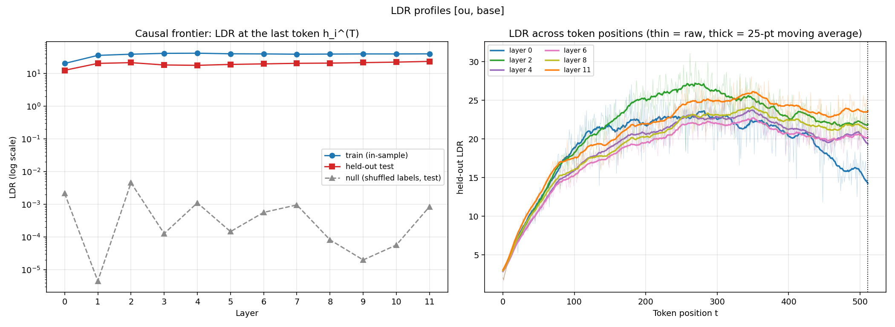
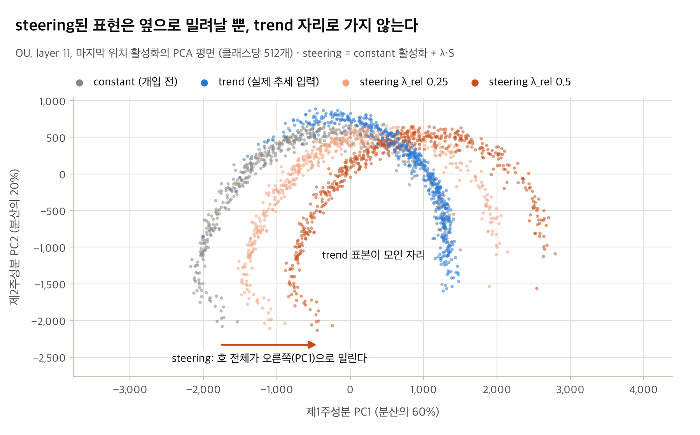
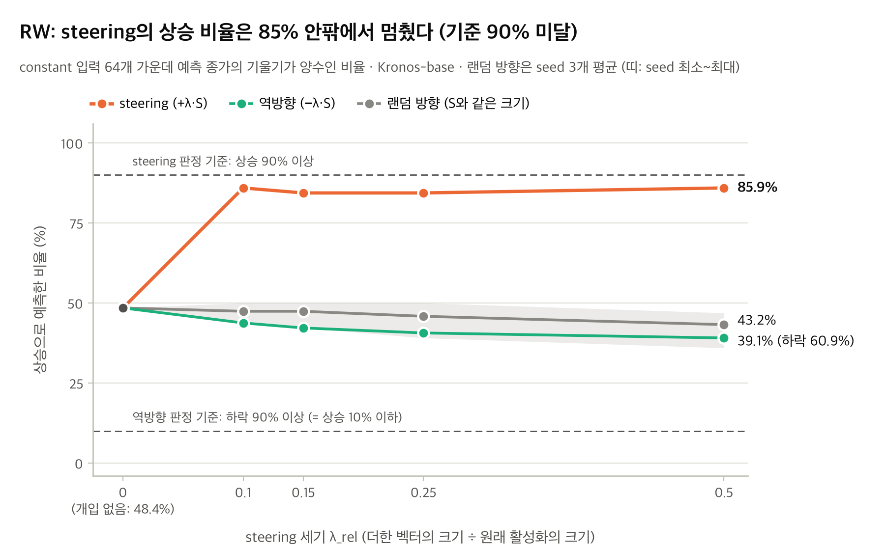

# Kronos-base는 '추세'를 예측에 쓰는가

### 선형 프로브와 steering으로 본 금융 TSFM의 내부 표현

실험: Kronos-base, 합성 OHLC(주 데이터 OU, 보조 RW) · RunPod RTX 4090 · 2026-10-05 · `experiment/runs/v2_fast` (commit `83ebf62`)

---

## 요약

이 보고서에서는 금융 OHLCVA 데이터로 학습한 시계열 파운데이션 모델 Kronos-base가 내부에서 '선형 상승 추세'를 선형으로 표현하는지, 그리고 그 표현을 예측에 쓰는지 확인했습니다. Wiliński et al.(ICML 2025)은 linear probe와 steering으로, 일반 시계열 모델인 MOMENT와 Chronos의 residual stream에서 주기성·추세 같은 개념이 선형으로 분리되고, 그 방향으로 개입하면 출력이 개념 쪽으로 바뀐다는 것을 보였습니다. 이 실험은 같은 방법을 금융 전용 모델인 kronos에 적용하고, 결과를 해석하기 위해 네 가지 질문에 하나씩 대응하는 대조군을 두었습니다. (1) residual stream에서 두 클래스가 잘 분리되는 것이 사전학습 덕분인가. (2) steering 효과가 steering 벡터 S의 방향 때문인가. (3) S는 +로 밀면 상승, −로 밀면 하락이 되는 양방향 축인가. (4) S를 더한 뒤의 예측이, 실제로 선형 상승을 가진 입력에 대한 예측과 닮았는가.

실험 결과, 4가지 질문에 대해 답변할 수 있었습니다. (1)주 합성 데이터인 평균회귀(OU) 합성 데이터에서 선형 프로브는 추세 데이터와 무추세 데이터를 잘 분리하여 판별했습니다. 하지만 학습하지 않은 Kronos도 같은 수준으로 갈랐습니다. (2),(3) steering은 64개 예측을 모두 상승으로 바꿨고, 같은 크기의 랜덤 방향으로는 이런 효과가 나지 않았습니다. (4)하지만 실제 상승 추세 데이터를 넣으면 Kronos는 64개 모두 하락을 예측했습니다. steering이 만든 상승 예측은 모델이 실제 추세에 보이는 반응과 달랐습니다.

추가 분석에서 한 가지가 드러났습니다. 두 클래스를 가른 프로브 방향과 예측을 바꾼 steering 벡터 S는 서로 거의 직교했습니다. 프로브가 읽는 방향과 출력을 움직이는 방향이 달랐으므로, 선형 분리와 steering 효과는 서로 다른 방향에 대한 결과이고 어느 쪽도 모델이 추세 개념을 쓴다는 근거가 되지 않습니다.

보조로 쓴 랜덤워크(RW) 데이터에서는 steering 효과가 평균회귀(OU) 합성 데이터에서 보인 수준에는 못 미쳤지만, steering 결과가 모델의 실제 추세 반응과 다르다는 점은 같았습니다.

결론적으로, 이 설정에서는 Kronos가 추세 개념을 예측에 쓴다는 증거를 찾지 못했습니다.

---

## 1. 배경과 질문

시계열 예측에서는 대규모 데이터로 사전학습한 TSFM(시계열 파운데이션 모델)이 빠르게 자리를 잡고 있습니다. Kronos는 그중 금융 K-line(OHLCVA) 데이터만으로 학습한 모델입니다. 실험에 쓴 Kronos-base의 구조는 다음과 같습니다. decoder-only Transformer 12층(d_model 832), 최대 컨텍스트 512봉입니다. 입력은 창마다 채널별로 z-score 정규화한 뒤 이산 토큰으로 바꿉니다.

NLP의 LLM은 attention으로 단어에 문맥상의 의미를 담습니다. 그리고 그 의미가 내부 표현(residual stream)에 선형 방향으로 나타난다는 연구가 많습니다. 그렇다면 같은 decoder-only 구조인 Kronos는 OHLCVA 시계열을 latent space에서 어떻게 표현하고 있을까요. 이 질문을 금융에서 가장 단순한 개념인 '선형 상승 추세'로 좁혀, 두 가지를 확인했습니다.

첫째, 추세가 Kronos 내부에 선형으로 구분되어 있는가. 둘째, 그 구분을 이용해 모델 내부에 개입하면 예측을 추세 방향으로 바꿀 수 있는가. 바꿀 수 있다면, 그것은 모델이 추세 개념을 예측에 쓴다는 뜻인가.

방법은 Wiliński et al., *Exploring Representations and Interventions in Time Series Foundation Models*(ICML 2025)에서 가져왔습니다. 이 논문은 MOMENT, Chronos 같은 TSFM에서 개념이 선형으로 분리되고, 두 클래스의 표현 차이를 더하면 출력이 그 개념 쪽으로 바뀐다고 보고했습니다. 금융 전용 모델에서는 아직 확인된 적이 없습니다.

---

## 2. 실험 설계

### 2.1 데이터

두 종류의 합성 OHLC를 클래스당 2048개씩 만들었습니다.

| 라벨 | 생성식 | 의미 |
|---|---|---|
| trend | `b + m·τ + W(τ)` | 같은 노이즈에 선형 상승 추세 |
| constant | `b + W(τ)` | 같은 노이즈, 추세 없음 |

같은 표본 번호의 두 데이터는 같은 노이즈 W를 공유합니다. 그래서 두 클래스는 추세 항 하나만 다릅니다. 길이는 512봉입니다. 추세의 크기는 노이즈 대비 3~6배(SNR)로 뽑았습니다. 거래량과 거래대금은 0으로 두었습니다.

노이즈는 평균회귀 과정(OU)을 주 데이터로 썼습니다. 4~5절은 모두 OU 결과입니다. 랜덤워크(RW) 노이즈로 만든 데이터는 결과가 유지되는지 확인하는 데만 쓰고, 6절에 따로 모았습니다.


*그림 1. OU 표본 3개. 위는 원시 가격, 아래는 z-score 정규화 뒤의 종가(constant / trend).*

### 2.2 선형 프로브

두 데이터를 Kronos에 넣고 12개 층의 residual stream을 라벨과 함께 저장했습니다. 층과 위치마다 Fisher criterion(LDA)으로 선형 프로브를 학습했습니다. 두 라벨이 얼마나 잘 갈리는지는 LDR로 쟀습니다. LDR은 프로브 방향 위에서 두 클래스 평균의 거리를 클래스 안의 퍼짐으로 나눈 값이고, 클수록 잘 갈립니다. 과적합을 피하려고 표본을 학습용 1434개와 평가용 614개로 나누고, 평가용의 값만 보고합니다.

### 2.3 Steering

trend와 constant의 residual stream 중앙값 차이로 steering 벡터 S를 만들었습니다. S는 층과 위치마다 따로 계산합니다. 새로운 constant 데이터 64개로 예측을 생성하는 동안, 모든 층·모든 위치의 residual stream에 λ·S를 더했습니다. 더하는 세기는 원래 활성화 크기에 대한 비율(λ_rel = 0.1, 0.15, 0.25, 0.5)로 정했습니다.

효과는 64스텝 예측 종가에 맞춘 직선 기울기로 판정했습니다. 64개 예측 중 기울기가 양수인 비율이 높아지면 예측이 상승 쪽으로 바뀐 것입니다.

---

## 3. 왜 다시 실험했나

초기 실험(1차)에서도 프로브는 두 데이터를 잘 갈랐고, steering은 32개 예측을 모두 상승으로 바꿨습니다. 하지만 이것만으로는 결과를 해석할 수 없었습니다. 프로브가 잘 분류되는 것이 사전학습의 결과인지 알 수 없었습니다. steering 효과가 정말 그 벡터 방향 때문인지도 가릴 기준이 없었습니다. 그래서 다음 대조군을 더해 재실험했습니다. 어떤 결과가 나오면 어떤 결론을 쓸지는 실험 전에 고정했습니다.

| 확인할 것 | 대조군 | 기준 (실험 전 고정) |
|---|---|---|
| 분리가 사전학습으로 생겼나 | 학습하지 않은 Kronos(구조는 같고 가중치만 초기화), 입력 자체의 분리도 | 사전학습 모델의 LDR이 2배를 넘어야 학습된 표현으로 본다 |
| steering 효과가 그 방향 때문인가 | S와 크기가 같은 랜덤 방향 벡터 (seed 3개) | steering이 상승 90% 이상(p < 0.01)이고, 같은 세기에서 랜덤 방향은 30~70% |
| 반대로 밀면 반대가 되나 | 부호를 뒤집은 −S | 하락 90% 이상 (p < 0.01) |
| 모델의 실제 추세 반응과 닮았나 | 실제 trend 입력에 대한 무개입 예측(REF) | 두 기울기 분포의 KS 검정 p ≥ 0.05 |

학습하지 않은 모델은 Kronos 자체의 초기화 방식으로 만들었습니다. PyTorch 기본 초기화는 임베딩이 약 29배 커서, 층을 지나도 표현이 거의 바뀌지 않는 모델이 되기 때문입니다. 이 선택은 실험 전에 정했습니다. 기본 초기화를 기준으로 했다면 분리에 대한 결론이 달라졌을 것입니다(부록 B).

재실험은 1차와 같은 코드와 시드로 돌렸고, 1차의 핵심 수치 14개 항목이 모두 다시 나왔습니다. 평가 입력은 32개에서 64개로 늘렸습니다.

---

## 4. 결과

이 절의 수치는 모두 주 데이터인 OU의 결과입니다.

### 4.1 모델은 두 데이터를 잘 분별하지만, 학습하지 않은 모델도 두 데이터를 분별 할 수 있음

| 평가용 LDR (layer 11, 마지막 위치) | 값 |
|---|---|
| 라벨을 섞었을 때 (최대) | 0.024 |
| 입력 자체 (close 경로) | 13.95 |
| 학습하지 않은 Kronos | 23.97 |
| 사전학습 Kronos | 23.53 |
| 사전학습 ÷ 학습하지 않음 | 0.98 |

선형 프로브는 두 데이터를 잘 갈랐습니다. 라벨을 섞었을 때보다 988배 높습니다.



*그림 2. 마지막 위치에서의 학습용 / 평가용 / 라벨 셔플 LDR과 위치별 LDR 곡선.*

층과 위치 전체로 보면 분리는 창의 중간(t ≈ 260~350)에서 가장 강합니다. 마지막 위치에서는 깊은 층일수록 LDR이 높습니다.


*그림 3. 층 × 위치별 LDR 히트맵(층마다 min-max 스케일).*

하지만 학습하지 않은 Kronos도 같은 수준으로 갈랐습니다(0.98배). 기준인 2배에 한참 못 미치므로, 분리가 사전학습으로 생겼다는 근거는 없습니다.


*그림 4. 입력 자체, 학습하지 않은 Kronos 두 종, 사전학습 Kronos의 층별·위치별 LDR.*


### 4.2 Steering: S를 더하면 64개 입력 모두에서 예측이 상승으로 바뀌었고, 같은 크기의 랜덤 방향으로는 바뀌지 않았다

**무엇을 64개 세었나.** 이 절의 수치는 모두 "64개 예측 중 몇 개가 상승인가"입니다. 64개는 다음과 같이 만들었습니다.

1. 추세 없는 constant 데이터 가운데 프로브 학습에 쓰지 않은 평가용 표본에서 앞 64개를 입력으로 골랐습니다. 입력 하나는 512봉이고, 그 안에는 추세가 없습니다.
2. Kronos에 입력 하나를 넣어 다음 64봉을 예측하게 했습니다. Kronos는 확률적으로 샘플링하므로 경로 5개를 뽑아 평균한 것을 그 입력의 예측 경로 하나로 삼았습니다. 입력 64개에서 예측 경로 64개가 나옵니다.
3. 예측 경로의 종가 64개에 직선을 맞춰 기울기를 구했습니다. 기울기가 양수면 그 예측을 "상승"으로 셉니다.
4. 같은 입력 64개를 네 조건에서 반복했습니다. 개입 없음, +S(steering), S와 층·위치별 크기를 같게 맞춘 랜덤 방향(seed 3개), −S(역방향)입니다. steering 세기 λ_rel마다 다시 돌렸습니다.

따라서 표의 100%는 64개 입력 전부, 48.4%는 64개 중 31개입니다. 랜덤 방향 열은 seed 3개의 비율을 평균한 값이고, 역방향 열만 "하락"(기울기 음수) 비율입니다. 개입하지 않았을 때 상승 비율은 48.4%(31/64)로, 추세 없는 입력에 대해 모델이 상승과 하락을 반반으로 예측했다는 뜻입니다.

| λ_rel | steering (+S) | 랜덤 방향 (seed 3개 평균) | 역방향 (−S, 하락 비율) |
|---|---|---|---|
| 0.1 | 60.9% (39/64) | 51.0% | 53.1% (34/64) |
| 0.15 | 82.8% (53/64) | 52.1% | 51.6% (33/64) |
| 0.25 | **100% (64/64)** | 49.5% | 65.6% (42/64) |
| 0.5 | **100% (64/64)** | 46.4% | 76.6% (49/64) |

**S 방향으로 밀면 전부 상승이 된다.** λ_rel 0.25부터 64개 입력 모두에서 예측 기울기가 양수가 되었습니다. 개입 없이 반반이던 것이 전부 상승으로 바뀐 것이고, 실험 전에 정한 기준(상승 90% 이상, 이항검정 p < 0.01)을 넘습니다. 단, 바뀐 기울기의 크기가 매우 작다는 점은 4.3에서 다룹니다.

**같은 크기의 랜덤 방향으로는 바뀌지 않는다.** S와 크기는 같지만 방향만 무작위인 벡터를 같은 세기로 더하면, 상승 비율은 모든 세기에서 46~52%에 머물렀습니다. 개입하지 않았을 때(48.4%)와 구별되지 않고, 기준 범위(30~70%) 안입니다. 즉 활성화를 그만큼 흔드는 것 자체로는 예측이 한쪽으로 몰리지 않고, 효과는 S의 방향에서만 나옵니다.

**거꾸로 밀면 거꾸로 되지는 않는다.** −S를 더했을 때 하락으로 바뀐 비율은 세기를 올려도 최대 76.6%(49/64)에 그쳐 기준(하락 90% 이상)에 못 미쳤습니다. −S도 +S처럼 64개 예측 기울기의 퍼짐을 크게 줄이지만(표준편차 0.024 → 0.003, +S는 0.001), 모인 자리가 0에서 떨어진 거리는 +S의 절반도 안 됩니다(λ_rel 0.5에서 평균 −0.0023, +S는 +0.0045). 그래서 일부 입력은 양수 쪽에 남습니다. +S와 −S의 효과가 대칭이 아닌 이유는 이 실험으로 설명하지 못했습니다.


### 4.3 자연 반응: 실제 상승 추세 입력 64개에 Kronos는 모두 하락을 예측했고, steering이 만든 상승 예측과는 분포가 전혀 겹치지 않았다

**무엇을 비교했나.** 4.2의 steering은 추세 없는 입력을 넣고 활성화를 S 방향으로 밀어 상승 예측을 만들었습니다. 그 결과가 "모델이 실제로 상승 추세를 받았을 때 내는 예측"과 같은 모양인지 보기 위해, 대조군 REF를 하나 더 두었습니다.

1. 4.2에서 쓴 constant 입력 64개와 같은 표본 번호의 trend 입력 64개를 골랐습니다. 2.1에서 설명한 대로 같은 번호의 두 데이터는 같은 노이즈를 공유하므로, 이 64개는 4.2의 입력에 선형 상승 추세 항만 더한 것입니다.
2. 이 trend 입력 64개를 아무 개입 없이 Kronos에 넣어 다음 64봉을 예측하게 했습니다. 예측 방식은 4.2와 같습니다(샘플 경로 5개 평균, 종가에 직선을 맞춘 기울기).
3. 그렇게 나온 REF 기울기 64개를 (a) 개입 없는 constant 입력의 기울기 64개, (b) steering(λ_rel 0.25) 뒤의 기울기 64개와 나란히 놓았습니다. 세 열의 입력은 노이즈가 같고, 추세 항의 유무와 개입의 유무만 다릅니다.

실험 전에 정한 기준은 "steering 뒤 기울기 분포와 REF 기울기 분포가 KS 검정에서 p ≥ 0.05이면 닮았다고 본다"입니다. 기울기는 정규화 공간(z-score 단위 / 봉)에서 잰 값입니다.

| | 개입 없음 (constant 입력) | 실제 trend 입력 (REF) | steering (λ_rel 0.25) |
|---|---|---|---|
| 기울기 평균 | −0.00085 | −0.06431 | +0.00357 |
| 기울기 표준편차 | 0.0242 | 0.0157 | 0.0014 |
| 기울기 범위 (최소 ~ 최대) | −0.048 ~ +0.068 | −0.094 ~ −0.028 | +0.0001 ~ +0.0063 |
| 상승 예측 (기울기 > 0) | 31/64 | **0/64** | 64/64 |

**실제 추세 입력에는 64개 모두 하락.** 상승 추세가 있는 입력 64개에 대해 Kronos는 하나도 상승을 예측하지 않았습니다. 가장 완만한 예측도 기울기 −0.028로, 개입 없는 constant 입력의 평균(−0.00085)보다 훨씬 가파른 하락입니다.

**steering 결과와는 분포가 겹치지 않는다.** steering은 64개를 모두 상승으로 만들었지만, 그 기울기는 +0.0001~+0.0063 사이의 매우 작은 양수입니다. REF의 가장 완만한 값(−0.028)과도 멀어 두 분포는 한 점도 겹치지 않고, KS 검정 p = 8.35e-38로 기준(p ≥ 0.05)에 한참 못 미칩니다. 부호만 다른 것이 아니라 크기도 다릅니다. steering이 만든 기울기의 절대값은 REF 평균의 약 1/18이고, 개입 없는 constant 입력의 자연스러운 퍼짐(표준편차 0.024)보다도 작습니다. 즉 steering은 "모델이 추세 입력에 하는 예측"을 만들어 낸 것이 아니라, 그와 무관한 자리에 예측을 모아 놓았습니다.

**REF는 '정답'이 아닙니다.** 모델이 상승 추세에 상승을 예측해야 한다고 전제한 비교가 아니라, steering 결과가 모델 자신의 추세 반응과 같은지를 보는 비교입니다. S는 바로 이 trend 입력들의 활성화로 만든 벡터인데, 그것을 더한 결과가 trend 입력 자체의 예측과 반대 부호로 나왔습니다. 다만 OU trend 입력은 실제 시장에서 보기 드문 매끈한 램프여서 학습 분포 밖일 수 있습니다. 그래서 "Kronos는 상승 추세에 하락을 예측한다"를 모델의 금융적 이해로 읽어서는 안 됩니다. 더 현실적인 RW 데이터에서도 같은 불일치가 나오는지는 6절에서 확인합니다.

**판정.** 실험 전에 정한 기준으로 정리하면 OU의 판정은 "방향 특이적 조정은 가능하나, 모델이 실제 추세 입력에 하는 계산과 다른 출력"입니다. 4.2의 세 기준 중 +S와 랜덤 방향은 충족, 역방향은 미충족이고, 4.3의 REF 기준은 미충족입니다.

---

## 5. 결과 해석


### 5.1 프로브가 읽는 방향과 출력을 움직이는 방향은 서로 달랐다

프로브 방향과 S의 코사인은 0.040입니다. 832차원에서 아무 두 방향이나 골라도 0.028 안팎이므로 사실상 직교입니다. 1차 실험에서 프로브 방향으로 같은 세기만큼 밀었을 때 예측은 바뀌지 않았습니다(상승 56.2%). 거꾸로 S 방향 하나에 투영하면 두 클래스는 대부분 겹칩니다(같은 표본에서 S 방향의 LDR 1.5, 프로브 방향은 30). "두 클래스가 선형으로 잘 갈린다"와 "클래스 차이 방향으로 밀면 예측이 바뀐다"는 서로 다른 방향에 대한 말이고, 둘 중 어느 것도 모델이 추세 개념을 쓴다는 뜻은 아닙니다.

steering 뒤의 표현을 PCA 평면에서 보면 같은 것이 보입니다. constant 표본 전체가 옆으로 밀릴 뿐, trend 표본이 모인 자리로 가지 않습니다(그림 6). 논문은 steering된 표본이 목표 클래스 근처로 간다고 보고했지만, Kronos에서는 그렇지 않았습니다.



*그림 6. layer 11, 마지막 위치 활성화의 PCA 평면. constant 활성화(회색)에 λ·S를 더하면(주황, λ_rel 0.25와 0.5) 호 전체가 PC1 방향으로 밀릴 뿐, trend 표본(파랑)이 모인 자리로 가지 않는다. 논문 Fig. 11에 대응한다.*

---

## 6. 랜덤워크 데이터에서도 유지되는가

RW는 실제 가격에 더 가까운 노이즈입니다. 대신 constant 표본도 우연히 추세를 띠는 경우가 많아 두 라벨의 차이가 흐립니다. 입력 기울기만으로 잰 LDR이 OU는 19.6, RW는 2.2입니다. 같은 실험을 RW로 돌린 결과를 OU와 나란히 놓으면 다음과 같습니다.

| | OU (4절) | RW |
|---|---|---|
| 사전학습 ÷ 학습하지 않음 (LDR) | 0.98 | 1.54 |
| steering 상승 비율 (λ_rel 0.1 / 0.15 / 0.25 / 0.5) | 60.9 / 82.8 / 100 / 100% | 85.9 / 84.4 / 84.4 / 85.9% |
| 랜덤 방향 평균 (λ_rel 0.25) | 49.5% | 45.8% |
| 역방향 하락 비율 (최대) | 76.6% | 60.9% |
| REF 상승 예측 | 0/64 | 32/64 |
| steering(λ_rel 0.25) 대 REF, KS p | 8.35e-38 | 1.73e-05 |
| 사전 판정 | 방향 특이적, REF와 불일치 | 기준 미달, REF와 불일치 |

**분리.** RW에서는 사전학습 모델이 학습하지 않은 모델보다 1.5배 높았고, 거의 모든 층과 위치에서 높았습니다. 일관된 차이지만 기준(2배)에는 못 미칩니다. 학습하지 않은 모델의 seed가 하나뿐이라, 이 차이가 seed 변동 안에 있는지는 알 수 없습니다. 분리가 가장 강한 곳도 OU와 달리 창의 마지막 위치입니다.


*그림 7. RW, 층 × 위치별 LDR 히트맵.*


*그림 8. RW, 입력 자체 / 학습하지 않은 Kronos 두 종 / 사전학습 Kronos의 층별·위치별 LDR.*

**Steering.** 상승 비율이 λ_rel 0.1부터 85% 안팎에서 멈춰 기준(90%)에 못 미쳤습니다. 효과가 없어서는 아닙니다. 64개 예측 기울기의 퍼짐(표준편차)은 모든 세기에서 개입 전의 약 7%로 줄었고, OU처럼 예측이 한곳에 모였습니다. 다만 모인 자리가 OU처럼 전부 0 위에 놓이지는 않아 10개 안팎이 하락으로 남았습니다. 어떤 입력이 하락으로 남는지는 이 보고서에서 설명하지 않습니다.



*그림 9. RW, steering 세기(λ_rel)에 따른 상승 예측 비율. 그림 5와 같은 축이며 역방향도 상승 비율로 그렸다. steering의 상승 비율이 λ_rel 0.1부터 85% 안팎에서 멈춰 기준선(90%)을 넘지 못한다.*

**자연 반응.** RW의 REF는 OU처럼 극단적이지 않습니다(상승 32/64, 중앙값 거의 0). 그런데도 steering 결과(54/64 상승)와 분포가 달랐습니다. 4.3절의 불일치가 OU trend 입력의 특이성 때문만은 아니라는 뜻입니다.

정리하면, RW에서는 steering 효과의 크기가 사전 기준에 못 미쳤습니다. 그래도 steering 결과가 모델의 실제 추세 반응과 다르다는 결론은 그대로 유지됩니다. RW의 사전 판정 문장은 "이 설정에서 인과적 사용의 증거 없음"입니다.

---

## 7. 결론

이 설정에서는 Kronos가 '추세'라는 개념을 예측에 쓴다는 증거를 찾지 못했습니다. 주 데이터(OU)에서 선형 분리는 있었지만 학습하지 않은 모델에서도 나타났습니다. steering은 예측을 바꿨지만, 모델의 실제 추세 반응과 다른 방식이었습니다. 랜덤워크 데이터에서도 steering 결과와 실제 추세 반응은 달랐습니다.

선형 프로브가 잘 분류하고 steering이 출력을 바꾸더라도, 그것만으로는 모델이 그 개념을 쓴다고 말할 수 없습니다. 학습하지 않은 모델, 랜덤 방향, 모델의 자연 반응 같은 대조군이 없으면 해석은 쉽게 과장됩니다. 초기 실험의 해석도 그랬습니다.

신뢰성이 중요한 금융 분야일수록, 모델의 설명가능성에 대한 주장도 이런 대조 실험으로 검증해야 합니다.

---

## 8. 한계와 다음 단계

평가 입력은 64개, 랜덤 방향 seed는 3개, 학습하지 않은 모델의 seed는 1개뿐입니다. RW에서 사전학습 모델이 1.5배 높았던 차이가 seed 변동 안에 있는지는 알 수 없습니다. 데이터는 합성뿐이고, OU trend 입력은 실제 시장에서 보기 드문 매끈한 램프라 학습 분포 밖일 수 있습니다. 4.1에서 본 것처럼 추세 항은 창 단위 z-score를 거치며 매끈함 등 다른 입력 통계도 함께 바꾸므로, 이 설계로는 추세 개념만 따로 떼어 볼 수 없습니다. 판정 기준(2배, 90%)도 사전에 정한 선일 뿐 근거가 있는 값은 아닙니다. 예측 경로를 저장하지 않아, steering 뒤의 예측이 계속 오르는 모양인지 한 번 올라 평평해지는 모양인지는 확인하지 못했습니다.

후속 실험에서는 이것들을 확인하려 합니다. 학습하지 않은 모델의 seed를 늘립니다. 저SNR OU나 실제 시세의 상승 구간으로 REF를 다시 확인합니다. 매끈함 등 부수 통계를 맞춘 클래스 쌍을 만듭니다. steering 벡터가 추세 외에 어떤 입력 통계를 담는지 분해합니다. λ_rel 0.1 미만의 세기를 시험합니다. 예측 경로를 저장합니다.

---

## 부록

### A. 재현

```
RUN_ID=v2_fast bash RunPod/runpod.sh          # pod에서 실행 (run_plan.py --plan fast)
bash RunPod/local.sh fetch v2_fast            # 로컬로 회수, checksum 대조
python docs/figs/make_summary_figs.py         # 그림 5~10, 13을 회수한 산출물에서 다시 그림
```

환경은 Python 3.12.3, torch 2.14.1+cu130, RTX 4090입니다. 전체 23단계, 82.8분이 걸렸습니다. 판정 규칙은 `docs/spec.md` §2.2, 요약은 `fast_summary.md`, 표본별 결과는 `results/v2/<noise>_base/steer/results.json`에 있습니다.

### B. 학습하지 않은 모델의 초기화 방식에 따른 차이

| 사전학습 ÷ 학습하지 않음 (layer 11, 마지막 위치) | OU | RW |
|---|---|---|
| Kronos 자체 초기화 (판정 기준) | 0.98 | 1.54 |
| PyTorch 기본 초기화 (참고) | 8.98 | 2.56 |

PyTorch 기본 초기화에서는 활성화 크기가 층을 지나도 거의 그대로였습니다(layer 0, 6, 11에서 13.445, 13.445, 13.453). 학습하지 않은 Transformer라기보다 토큰 임베딩에 가까운 대조군이어서 판정 기준에서 뺐습니다.
