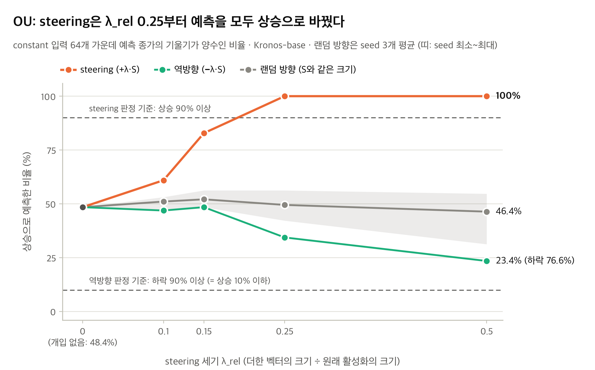
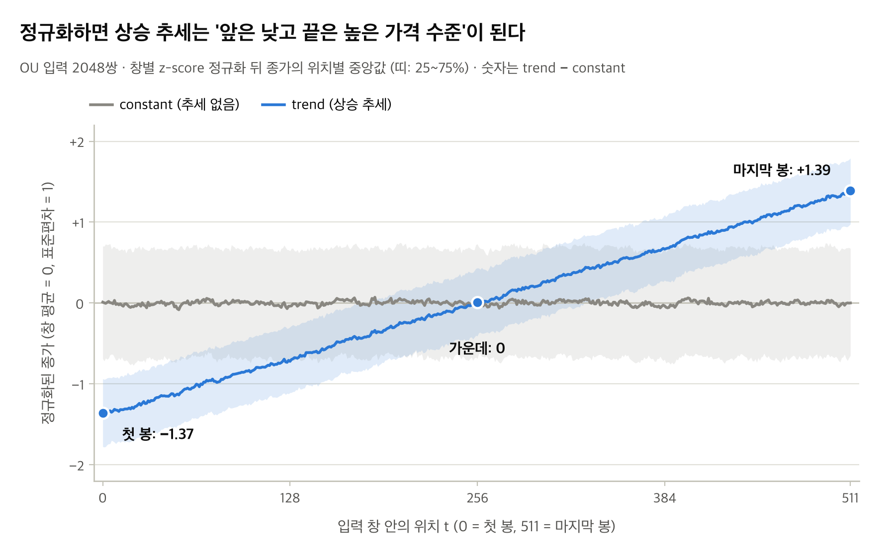
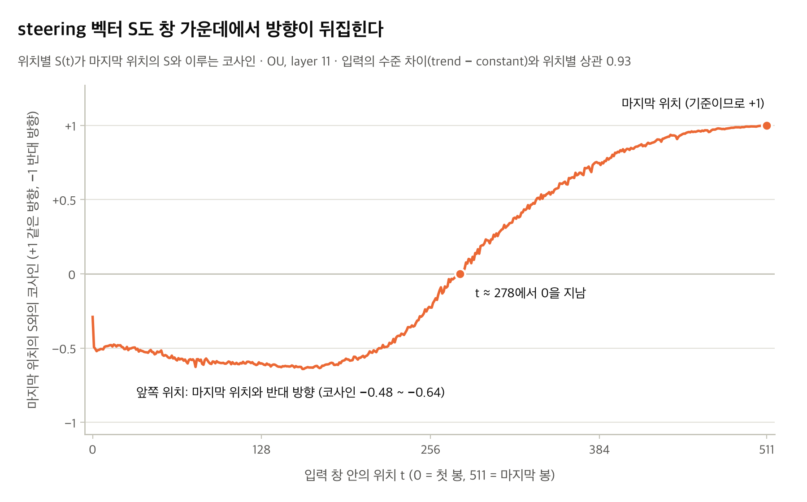
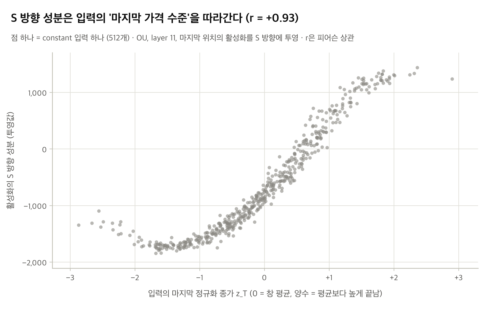
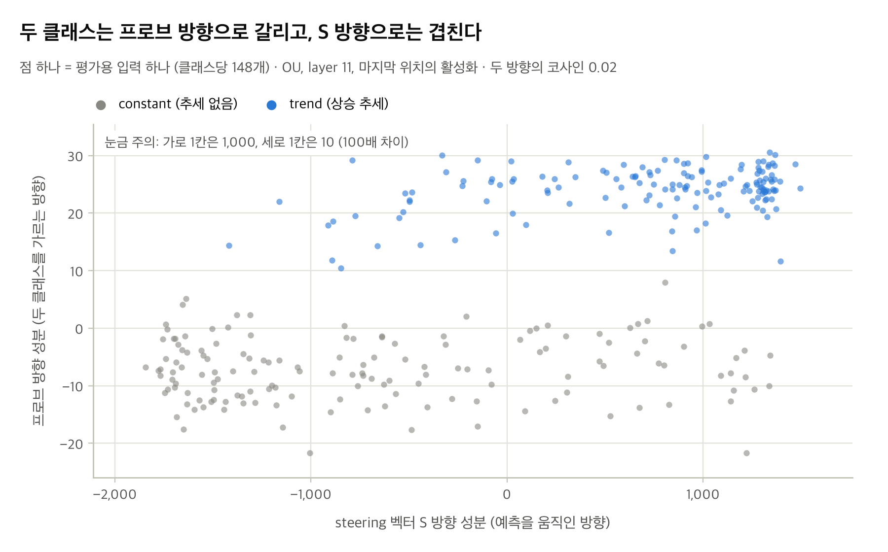

# Kronos-base는 '선형상승'의 개념을 예측 생성 과정에서 사용하는가

### linear probing과 steering으로 본 금융 TSFM의 내부 표현(latent space)

실험 : 합성 OHLC으로 Kronos-base(AAAI 26)의 residual stream 상태를 확인  
실험 환경 : RunPod RTX 4090  
날짜 : 2026-08-15 

---

## 요약

금융 OHLCVA 데이터로 학습한 시계열 파운데이션 모델 Kronos-base가 내부에서 '선형 상승'을 표현하는지, 그리고 그 표현을 예측에 쓰는지 확인했습니다. Wiliński et al.(ICML 2025)의 linear probe와 steering을 사용하여 일반 시계열 예측 모델인 MOMENT 모델이 "시계열의 일반적인 개념"을 residual stream에서 분리하고 예측과정에서 해당 개념을 사용한다는 사실을 밝혔는데, Kronos-base 모델에도 적용이 가능한지 확인하는 과정을 거쳤습니다. 실험 결과를 해석하기 위해 대조군을 설정해서 실험했고 각 대조군은 아래의 질문에 답하기 위해 설정되었습니다. 1. "residual stream에서 두 클래스의 합성 데이터를 잘 분리하는것이 사전학습 덕분인가?" 2. "steering 효과가 steering vector(S)의 방향 때문인가?" 3. "S를 + 쪽으로 밀면 상승, − 쪽으로 밀면 하락으로 작동하는 양방향으로 작동하는 축인가?" 4. "S를 더해서 선형상승을 가지도록 한 residual stream이 만들어내는 예측이 선형상승을 가진 입력데이터를 넣었을때의 예측값과 닮았나?"

선형 프로브는 추세 데이터와 무추세 데이터를 잘 갈랐다. 하지만 학습하지 않은 Kronos도 같은 수준으로 갈랐다. steering은 평균회귀(OU) 데이터에서 64개 예측을 모두 상승으로 바꿨고, 같은 크기의 랜덤 방향으로는 이런 효과가 나지 않았다. 그런데 실제 상승 추세 데이터를 넣으면 Kronos는 64개 모두 하락을 예측했다. steering이 만든 상승 예측은 모델이 실제 추세에 보이는 반응과 달랐다.

원인을 따라가 보면 두 가지가 드러난다. steering은 예측을 끌어올린 것이 아니라 입력에 대한 모델의 반응을 누른 것이었다. 그리고 steering 벡터는 추세가 아니라 '마지막 가격 수준'의 방향이었다. 결론적으로, 이 설정에서는 Kronos가 추세 개념을 예측에 쓴다는 증거를 찾지 못했다.

---

## 1. 배경과 질문

시계열 예측에서는 대규모 데이터로 사전학습한 TSFM(시계열 파운데이션 모델)이 빠르게 자리를 잡고 있다. Kronos는 그중 금융 K-line(OHLCVA) 데이터만으로 학습한 모델이다. 실험에 쓴 Kronos-base의 구조는 다음과 같다. decoder-only Transformer 12층(d_model 832), 최대 컨텍스트 512봉이다. 입력은 창마다 채널별로 z-score 정규화한 뒤 이산 토큰으로 바꾼다.

NLP의 LLM은 attention으로 단어에 문맥상의 의미를 담는다. 그리고 그 의미가 내부 표현(residual stream)에 선형 방향으로 나타난다는 연구가 많다. 그렇다면 같은 decoder-only 구조인 Kronos는 OHLCVA 시계열을 latent space에서 어떻게 표현하고 있을까. 이 질문을 금융에서 가장 단순한 개념인 '선형 상승 추세'로 좁혀, 두 가지를 확인했다.

첫째, 추세가 Kronos 내부에 선형으로 구분되어 있는가. 둘째, 그 구분을 이용해 모델 내부에 개입하면 예측을 추세 방향으로 바꿀 수 있는가. 바꿀 수 있다면, 그것은 모델이 추세 개념을 예측에 쓴다는 뜻인가.

방법은 Wiliński et al., *Exploring Representations and Interventions in Time Series Foundation Models*(ICML 2025)에서 가져왔다. 이 논문은 MOMENT, Chronos 같은 TSFM에서 개념이 선형으로 분리되고, 두 클래스의 표현 차이를 더하면 출력이 그 개념 쪽으로 바뀐다고 보고했다. 금융 전용 모델에서는 아직 확인된 적이 없다.

---

## 2. 실험 설계

### 2.1 데이터

두 종류의 합성 OHLC를 클래스당 2048개씩 만들었다.

| 라벨 | 생성식 | 의미 |
|---|---|---|
| trend | `b + m·τ + W(τ)` | 같은 노이즈에 선형 상승 추세 |
| constant | `b + W(τ)` | 같은 노이즈, 추세 없음 |

같은 표본 번호의 두 데이터는 같은 노이즈 W를 공유한다. 그래서 두 클래스는 추세 항 하나만 다르다. 노이즈는 평균회귀 과정(OU)을 주로 쓰고, 랜덤워크(RW)는 결과가 유지되는지 보는 보조 데이터로 썼다. 길이는 512봉이다. 추세의 크기는 노이즈 대비 3~6배(SNR)로 뽑았다. 거래량과 거래대금은 0으로 두었다.


*그림 1. OU 표본 3개. 위는 원시 가격, 아래는 z-score 정규화 뒤의 종가(constant / trend).*

### 2.2 선형 프로브

두 데이터를 Kronos에 넣고 12개 층의 residual stream을 라벨과 함께 저장했다. 층과 위치마다 Fisher criterion(LDA)으로 선형 프로브를 학습했다. 두 라벨이 얼마나 잘 갈리는지는 LDR로 쟀다. LDR은 프로브 방향 위에서 두 클래스 평균의 거리를 클래스 안의 퍼짐으로 나눈 값이고, 클수록 잘 갈린다. 과적합을 피하려고 표본을 학습용 1434개와 평가용 614개로 나누고, 평가용의 값만 보고한다.

### 2.3 Steering

trend와 constant의 residual stream 중앙값 차이로 steering 벡터 S를 만들었다. S는 층과 위치마다 따로 계산한다. 새로운 constant 데이터 64개로 예측을 생성하는 동안, 모든 층·모든 위치의 residual stream에 λ·S를 더했다. 더하는 세기는 원래 활성화 크기에 대한 비율(λ_rel = 0.1, 0.15, 0.25, 0.5)로 정했다.

효과는 64스텝 예측 종가에 맞춘 직선 기울기로 판정했다. 64개 예측 중 기울기가 양수인 비율이 높아지면 예측이 상승 쪽으로 바뀐 것이다.

---

## 3. 왜 다시 실험했나

초기 실험(1차)에서도 프로브는 두 데이터를 잘 갈랐고, steering은 32개 예측을 모두 상승으로 바꿨다. 하지만 이것만으로는 결과를 해석할 수 없었다. 프로브가 잘 분류되는 것이 사전학습의 결과인지 알 수 없었다. steering 효과가 정말 그 벡터 방향 때문인지도 가릴 기준이 없었다. 그래서 다음 대조군을 더해 재실험했다. 어떤 결과가 나오면 어떤 결론을 쓸지는 실험 전에 고정했다.

| 확인할 것 | 대조군 | 기준 (실험 전 고정) |
|---|---|---|
| 분리가 사전학습으로 생겼나 | 학습하지 않은 Kronos(구조는 같고 가중치만 초기화), 입력 자체의 분리도 | 사전학습 모델의 LDR이 2배를 넘어야 학습된 표현으로 본다 |
| steering 효과가 그 방향 때문인가 | S와 크기가 같은 랜덤 방향 벡터 (seed 3개) | steering이 상승 90% 이상(p < 0.01)이고, 같은 세기에서 랜덤 방향은 30~70% |
| 반대로 밀면 반대가 되나 | 부호를 뒤집은 −S | 하락 90% 이상 (p < 0.01) |
| 모델의 실제 추세 반응과 닮았나 | 실제 trend 입력에 대한 무개입 예측(REF) | 두 기울기 분포의 KS 검정 p ≥ 0.05 |

학습하지 않은 모델은 Kronos 자체의 초기화 방식으로 만들었다. PyTorch 기본 초기화는 임베딩이 약 29배 커서, 층을 지나도 표현이 거의 바뀌지 않는 모델이 되기 때문이다. 이 선택은 실험 전에 정했다. 기본 초기화를 기준으로 했다면 분리에 대한 결론이 달라졌을 것이다(부록 B).

재실험은 1차와 같은 코드와 시드로 돌렸고, 1차의 핵심 수치 14개 항목이 모두 다시 나왔다. 평가 입력은 32개에서 64개로 늘렸다.

---

## 4. 결과

### 4.1 분리: 잘 갈리지만, 학습하지 않은 모델도 갈랐다

| 평가용 LDR (layer 11, 마지막 위치) | OU | RW |
|---|---|---|
| 라벨을 섞었을 때 (최대) | 0.024 | 0.024 |
| 입력 자체 (close 경로) | 13.95 | 1.69 |
| 학습하지 않은 Kronos | 23.97 | 10.24 |
| 사전학습 Kronos | 23.53 | 15.74 |
| 사전학습 ÷ 학습하지 않음 | 0.98 | 1.54 |

선형 프로브는 두 데이터를 잘 갈랐다. 라벨을 섞었을 때보다 OU에서 988배, RW에서 631배 높다.


*그림 2. OU, 마지막 위치에서의 학습용 / 평가용 / 라벨 셔플 LDR과 위치별 LDR 곡선.*

층과 위치 전체로 보면 분리가 가장 강한 곳은 두 데이터가 다르다. OU는 창의 중간(t ≈ 260~350)에서, RW는 마지막 위치에서 가장 잘 갈린다. 두 데이터 모두 마지막 위치에서는 깊은 층일수록 LDR이 높다.


*그림 3. OU, 층 × 위치별 LDR 히트맵(층마다 min-max 스케일).*


*그림 4. RW, 같은 히트맵.*

하지만 OU에서는 학습하지 않은 Kronos도 같은 수준으로 갈랐다. RW에서는 사전학습 모델이 1.5배 높았지만 기준(2배)에는 못 미쳤다. 두 데이터 모두 분리가 사전학습으로 생겼다는 근거는 없다.


*그림 5. OU, 입력 자체 / 학습하지 않은 Kronos 두 종 / 사전학습 Kronos의 층별·위치별 LDR.*


*그림 6. RW, 같은 비교.*

### 4.2 Steering: 예측은 바뀌었고, 그 방향만의 효과였다

64개 예측 중 상승 비율(역방향 L은 하락 비율). 개입하지 않았을 때는 두 데이터 모두 48.4%다.

| λ_rel | OU: steering | OU: 랜덤 방향 | OU: 역방향 | RW: steering | RW: 랜덤 방향 | RW: 역방향 |
|---|---|---|---|---|---|---|
| 0.1 | 60.9% | 51.0% | 53.1% | 85.9% | 47.4% | 56.2% |
| 0.15 | 82.8% | 52.1% | 51.6% | 84.4% | 47.4% | 57.8% |
| 0.25 | **100%** | 49.5% | 65.6% | 84.4% | 45.8% | 59.4% |
| 0.5 | **100%** | 46.4% | 76.6% | 85.9% | 43.2% | 60.9% |

OU에서는 λ_rel 0.25부터 64개 예측이 모두 상승으로 바뀌었다. 같은 크기의 랜덤 방향은 절반 안팎에 머물렀으므로, 이 효과는 steering 벡터 방향에서만 나온다. RW에서는 처음부터 85% 안팎에서 더 오르지 않아 기준(90%)에 못 미쳤다. 반대로 더했을 때 하락으로 바뀌는 비율은 두 데이터 모두 기준에 한참 못 미쳤다.



*그림 7. OU, steering 세기(λ_rel)에 따른 상승 예측 비율. 같은 constant 입력 64개에 +S(steering), 같은 크기의 랜덤 방향(seed 3개 평균, 띠는 seed 범위), −S(역방향)를 더했다. 점선은 실험 전에 정한 판정 기준이다. 역방향도 상승 비율로 그렸으므로, 위 표의 하락 비율은 100%에서 이 값을 뺀 것이다.*


*그림 8. RW, 같은 그림. steering의 상승 비율이 λ_rel 0.1부터 85% 안팎에서 멈춰 기준선(90%)을 넘지 못한다.*

### 4.3 자연 반응: 진짜 추세를 넣으면 Kronos는 하락을 예측했다

| | 개입 없음 (constant 입력) | 실제 trend 입력 (REF) | steering (λ_rel 0.25) |
|---|---|---|---|
| OU 기울기 평균 | −0.00085 | −0.06431 | +0.00357 |
| OU 상승 예측 | 31/64 | **0/64** | 64/64 |
| RW 기울기 평균 | −0.00113 | −0.00800 | +0.00346 |
| RW 상승 예측 | 31/64 | 32/64 | 54/64 |

OU에서 실제 상승 추세 데이터를 넣으면 Kronos는 64개 모두 하락을 예측했다. steering이 만든 예측과는 두 분포가 완전히 갈린다(KS p = 8.35e-38). RW에서도 두 분포는 다르다(KS p = 1.73e-05). steering은 예측을 바꿀 수 있었지만, 그 결과는 모델이 실제 추세에 보이는 반응과 닮지 않았다.

실험 전에 정한 기준으로 정리하면, OU는 "방향 특이적 조정은 가능하나 모델이 실제 추세 입력에 하는 계산과 다른 출력"이고, RW는 "이 설정에서 인과적 사용의 증거 없음"이다.

---

## 5. 왜 이런 결과가 나왔나

여기부터는 결과를 본 뒤 저장된 산출물로 추가 계산한 분석이다. 판정에는 쓰지 않았다.

### 5.1 Kronos의 실제 행동은 '수준 되돌림'이고, steering은 그 반응을 눌렀다

개입하지 않은 Kronos의 예측은 입력의 마지막 가격 위치에 따라 정해졌다. 정규화된 마지막 종가(z_T)가 창 평균보다 높으면 하락을, 낮으면 상승을 예측한다. OU에서 예측 기울기와 z_T의 상관은 −0.77이다.

steering을 더하면 이 반응의 기울기(회귀계수)가 −0.0179에서 −0.0006~−0.0009로, 약 1/20~1/30로 줄어든다. 그 위에 +0.0036~+0.0045 정도의 작은 양수가 얹힌다. 반응이 거의 지워지고 작은 양수만 남으니 64개 예측이 모두 상승으로 집계된 것이다. 같은 입력끼리 비교하면 steering 뒤의 기울기가 개입 전보다 큰 입력은 64개 중 34~38개뿐이다. 예측을 위로 끌어올렸다기보다 한곳으로 모은 것에 가깝다.

RW의 85%도 같은 방식으로 설명된다. 랜덤워크는 창 평균에서 멀리 떨어진 곳에서 끝나는 경우가 많다. 그래서 반응을 눌러도 마지막 가격이 아주 높은 입력은 여전히 하락으로 남는다. λ_rel 0.25에서 하락으로 남은 10개는 z_T가 1.84~3.45인 입력이었고, 나머지 54개의 평균은 −0.26이었다.

### 5.2 steering 벡터는 '추세'가 아니라 '마지막 가격 수준'의 방향이었다

Kronos는 입력을 창마다 z-score로 정규화한다. 그러면 상승 추세는 "앞은 평균보다 낮고 끝은 평균보다 높은 수준"으로 바뀐다. 실제로 위치별 trend − constant의 수준 차이는 첫 위치에서 −1.37, 가운데에서 0, 마지막 위치에서 +1.39였다. steering 벡터도 이 패턴을 따라간다. 위치별 S의 방향은 이 수준 차이와 0.93의 상관을 보였고, S의 크기는 수준 차이가 0이 되는 가운데(t ≈ 256~288)에서 가장 작다.



*그림 9. OU 입력 2048쌍에서, 정규화(창별 z-score) 뒤 종가의 위치별 중앙값. 띠는 25~75% 범위다. trend는 첫 봉에서 constant보다 1.37 낮고, 가운데에서 같아지며, 마지막 봉에서 1.39 높다.*



*그림 10. OU layer 11, 위치별 steering 벡터 S(t)가 마지막 위치의 S와 이루는 코사인. 앞쪽 위치에서는 반대 방향(음수)이고, t ≈ 278에서 0을 지나 뒤쪽에서는 같은 방향이 된다. 그림 9에서 수준 차이의 부호가 바뀌는 자리와 거의 같다.*

그래서 마지막 위치의 S는 결국 "끝 가격이 창 평균보다 높다"는 방향이다. OU layer 11에서 S 방향 투영값과 z_T의 상관은 +0.93이다. 이 방향은 constant 입력들 사이에서도 표현이 가장 크게 흔들리는 축이다. S 방향 하나가 constant 활성화 분산의 45%(OU), 26%(RW)를 담는다. 임의의 방향이라면 0.12% 정도다. S는 활성화의 첫 번째 주성분(PC1)과 거의 같은 방향이다(|cos| 0.86~0.97).



*그림 11. OU layer 11, 마지막 위치. constant 입력 512개 각각에 대해, 입력의 마지막 정규화 종가 z_T(가로)와 활성화의 S 방향 성분(세로)을 찍었다. 입력이 창 평균보다 높게 끝날수록 S 방향 성분이 크다(상관 +0.93).*

### 5.3 프로브가 읽는 방향과 출력을 움직이는 방향은 달랐다

프로브 방향은 입력의 기울기, 그리고 '매끈함'을 따라갔다. 매끈함은 z-score의 부산물이다. 추세가 있으면 창 전체의 표준편차가 커지고, 같은 표준편차로 나누니 봉 하나하나의 움직임이 작아 보인다. 손으로 만든 입력 통계 4개(기울기, 거칠기, 첫 봉 범위, 잔차 표준편차)만으로 OU에서 LDR 22.88이 나온다. 사전학습 Kronos의 23.53과 거의 같다. 또 프로브 방향은 활성화 분산의 0.014%만 담는다. S가 표현이 가장 크게 흔들리는 축이라면, 프로브 방향은 거의 흔들리지 않는 축이다.



*그림 12. OU layer 11, 마지막 위치. 평가용 입력(클래스당 148개)의 활성화를 steering 벡터 S 방향 성분(가로)과 프로브 방향 성분(세로)으로 나눠 찍었다. 두 클래스는 세로로 갈리고 가로로는 겹친다. 가로축 눈금은 세로축의 100배다. 활성화는 S 방향으로 크게 흔들리고 프로브 방향으로는 거의 흔들리지 않는다.*

프로브 방향과 steering 벡터의 코사인은 0.040(OU), 0.022(RW)다. 832차원에서 임의의 두 방향이 갖는 값(약 0.028)과 같은 크기로, 거의 직교한다. 1차 실험에서 프로브 방향으로 밀었을 때는 예측이 바뀌지 않았다(상승 56.2%, 표준편차 비 0.95). 반대로 랜덤 벡터도 프로브 방향 위의 값을 꽤 움직였지만 예측의 부호는 모이지 않았다. 모델 안에서 개념이 '읽히는' 방향과 출력을 '움직이는' 방향이 서로 달랐다.

steering 뒤의 표현을 보면 이 차이가 더 분명하다. 프로브 방향 위에서는 steering된 평균이 trend 쪽으로 이동한다(OU, λ_rel 0.25에서 두 클래스 간격의 약 절반, 0.5에서 약 1.1배). 그러나 PCA 평면에서는 constant 표본들이 통째로 PC1 방향으로 옮겨질 뿐, trend 표본이 모인 자리에 겹치지 않는다. λ가 커질수록 실제 활성화가 없는 영역으로 나간다. 논문은 steering된 표본이 목표 클래스 근처로 간다고 보고했지만, Kronos에서는 그렇지 않았다.


*그림 13. OU layer 11, 마지막 위치 활성화의 PCA 평면. constant 활성화(회색)에 λ·S를 더하면(주황, λ_rel 0.25와 0.5) 호 전체가 PC1 방향으로 밀릴 뿐, trend 표본(파랑)이 모인 자리로 가지 않는다. 논문 Fig. 11에 대응한다.*

---

## 6. 결론

이 설정에서는 Kronos가 '추세'라는 개념을 예측에 쓴다는 증거를 찾지 못했다. 선형 분리는 있었지만 학습하지 않은 모델에서도 나타났다. steering은 예측을 바꿨지만, 모델의 실제 추세 반응과 다른 방식이었다.

선형 프로브가 잘 분류하고 steering이 출력을 바꾸더라도, 그것만으로는 모델이 그 개념을 쓴다고 말할 수 없다. 학습하지 않은 모델, 랜덤 방향, 모델의 자연 반응 같은 대조군이 없으면 해석은 쉽게 과장된다. 초기 실험의 해석도 그랬다.

신뢰성이 중요한 금융 분야일수록, 모델의 설명가능성에 대한 주장도 이런 대조 실험으로 검증해야 한다.

---

## 7. 한계와 다음 단계

평가 입력은 64개, 랜덤 방향 seed는 3개, 학습하지 않은 모델의 seed는 1개뿐이다. RW에서 사전학습 모델이 1.5배 높았던 차이가 seed 변동 안에 있는지는 알 수 없다. 데이터는 합성뿐이다. 창 단위 z-score가 만드는 수준 차이와 매끈함 차이가 '추세'와 섞여 있어서, 이 설계로는 추세 개념만 따로 떼어 볼 수 없다. 판정 기준(2배, 90%)도 사전에 정한 선일 뿐 근거가 있는 값은 아니다. 예측 경로를 저장하지 않아, steering 뒤의 예측이 계속 오르는 모양인지 한 번 올라 평평해지는 모양인지는 확인하지 못했다.

후속 실험에서는 이것들을 확인하려 한다. 학습하지 않은 모델의 seed를 늘린다. 마지막 가격 수준과 매끈함을 맞춘 클래스 쌍을 만든다. steering 벡터에서 수준 성분을 빼고 개입한다. λ_rel 0.1 미만의 세기를 시험한다. 예측 경로를 저장한다. 5.1절의 수준 되돌림을 보여 줄 z_T 대 예측 기울기 산점도도 아직 없어 새로 그려야 한다.

---

## 부록

### A. 재현

```
RUN_ID=v2_fast bash RunPod/runpod.sh          # pod에서 실행 (run_plan.py --plan fast)
bash RunPod/local.sh fetch v2_fast            # 로컬로 회수, checksum 대조
python docs/figs/make_summary_figs.py         # 그림 7~13을 회수한 산출물에서 다시 그림
```

환경은 Python 3.12.3, torch 2.14.1+cu130, RTX 4090이다. 전체 23단계, 82.8분이 걸렸다. 판정 규칙은 `docs/spec.md` §2.2, 요약은 `fast_summary.md`, 표본별 결과는 `results/v2/<noise>_base/steer/results.json`에 있다.

### B. 학습하지 않은 모델의 초기화 방식에 따른 차이

| 사전학습 ÷ 학습하지 않음 (layer 11, 마지막 위치) | OU | RW |
|---|---|---|
| Kronos 자체 초기화 (판정 기준) | 0.98 | 1.54 |
| PyTorch 기본 초기화 (참고) | 8.98 | 2.56 |

PyTorch 기본 초기화에서는 활성화 크기가 층을 지나도 거의 그대로였다(layer 0, 6, 11에서 13.445, 13.445, 13.453). 학습하지 않은 Transformer라기보다 토큰 임베딩에 가까운 대조군이어서 판정 기준에서 뺐다.
